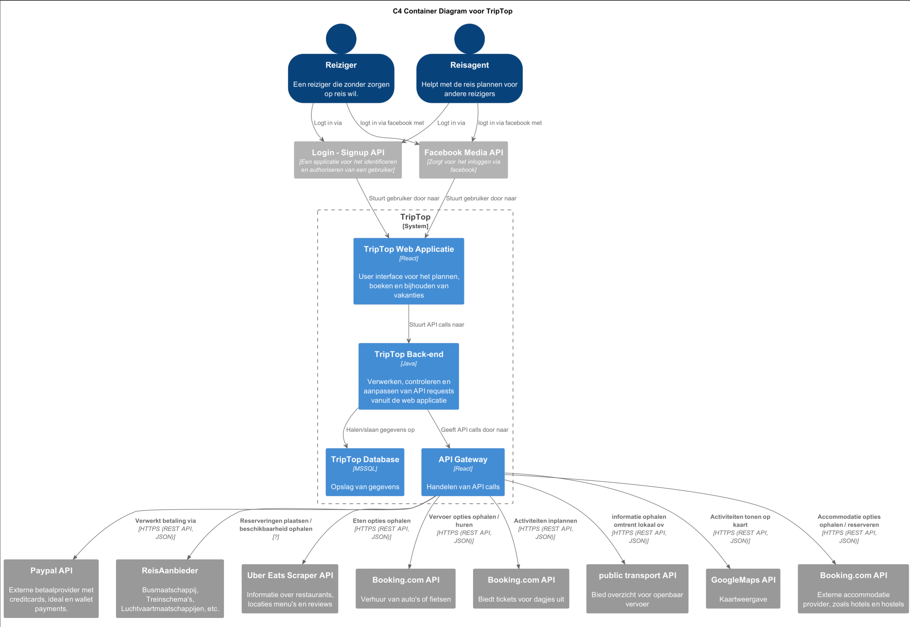

# Software Guidebook Triptop

## 1. Introduction
Dit software guidebook geeft een overzicht van de Triptop-applicatie. Het bevat een samenvatting van het volgende: 
1. De vereisten, beperkingen en principes. 
1. De software-architectuur, met inbegrip van de technologiekeuzes op hoog niveau en de structuur van de software. 
1. De ontwerp- en codebeslissingen die zijn genomen om de software te realiseren.
1. De architectuur van de infrastructuur en hoe de software kan worden geinstalleerd. 

## 2. Context

### 2.1 Gebruikers

De gebruikers van het systeem zijn mensen die een reis willen plannen en boeken via Triptop. In het diagram worden zij aangeduid als **"reiziger"**.  
Daarnaast zijn er medewerkers van (digitale) reisbureaus, aangeduid als **"reisagent"**, die reizigers ondersteunen bij het boeken van hun droomreis.  
Uiteraard zijn er ook bezoekers die gewoon even komen kijken wat de website te bieden heeft. Deze laten we in deze context buiten beschouwing, omdat bijna alle functionaliteiten alleen van toepassing zijn als je daadwerkelijk inlogt en een vakantie boekt.  
Verder geldt dit diagram enkel voor gebruikers; beheerders of andere betrokkenen hebben een andere context.

### 2.2 Functionaliteit & externe systemen

Binnen Triptop zijn verschillende functionaliteiten beschikbaar die het boeken en beleven van een reis ondersteunen. Deze **'bouwstenen'** hebben elk hun eigen functie.  
In het contextdiagram zijn de volgende functionaliteiten opgenomen:

- **Betaalsysteem:** Dit systeem maakt betalingen binnen de applicatie mogelijk, zoals het boeken van een vlucht of het bestellen van tickets voor een museum.
- **Reisaanbieder:** Hier kunnen reizigers vluchten, treinreizen of busreizen naar hun bestemming bekijken en eventueel boeken. Dit betreft voornamelijk de reis naar de vakantiebestemming. Voor lokaal vervoer, zie 'Openbaar vervoer' en 'Autoaanbieder'.
- **Eetaanbieder:** Reizigers kunnen restaurants in de buurt bekijken, inclusief locaties, menukaarten en reviews, om eenvoudig een geschikte eetgelegenheid te vinden.
- **Autoaanbieder:** Biedt reizigers de mogelijkheid om een auto te huren op locatie.
- **Dagbesteding:** Hier zijn bezienswaardigheden in de buurt te vinden, en het is mogelijk om tickets te bestellen voor activiteiten.
- **Openbaar vervoer:** Toont reisschema’s van verschillende opties voor het openbaar vervoer, zodat reizigers eenvoudig hun lokale reis kunnen plannen.
- **Google Maps:** Een kaart waarop locaties worden weergegeven, zodat gebruikers kunnen zien waar ze zijn en waar ze naartoe kunnen gaan.
- **Accommodatie:** Hiermee kunnen reizigers hun verblijf regelen, boeken en betalen via de applicatie.

Voor alle functionaliteiten worden externe systemen gebruikt, zodat de functionaliteiten lokaal beschikbaar zijn en gebruikers maximaal comfort ervaren.  
In **hoofdstuk 7** worden de API's verder toegelicht en uitgelegd in de vorm van een **containerdiagram**.

## 3. Functional Overview

Om de belangrijkste features toe te lichten zijn er user stories en twee domain stories gemaakt en een overzicht van het domein in de vorm van een domeinmodel. Op deze plek staat typisch een user story map maar die ontbreekt in dit voorbeeld.

### 3.1 User Stories

#### 3.1.1 User Story 1: Reis plannen

Als gebruiker wil ik een zelfstandig op basis van diverse variabelen (bouwstenen) een reis kunnen plannen op basis van mijn reisvoorkeuren (wel/niet duurzaam reizen, budget/prijsklasse, 's nachts reizen of overdag etc.) zodat ik op vakantie kan gaan zonder dat hiervoor een reisbureau benodigd is.

#### 3.1.2 User Story 2: Reis boeken

Als gebruiker wil ik een geplande reis als geheel of per variabele (bouwsteen) boeken en betalen zodat ik op vakantie kan gaan zonder dat hiervoor een reisbureau benodigd is.

#### 3.1.3 User Story 3: Reis cancelen

Als gebruiker wil ik een geboekte reis, of delen daarvan, kunnen annuleren zodat ik mijn geld terug kan krijgen zonder inmenging van een intermediair zoals een reisbureau.

#### 3.1.4 User Story 4: Reisstatus bewaren 

Als gebruiker wil ik mijn reisstatus kunnen bewaren zonder dat ik een extra account hoef aan te maken zodat ik mijn reis kan volgen zonder dat ik daarvoor extra handelingen moet verrichten.

#### 3.1.5 User Story 5: Bouwstenen flexibel uitbreiden

Als gebruiker wil ik de bouwstenen van mijn reis flexibel kunnen uitbreiden met een zelf te managen stap (bijv. met providers die niet standaard worden aangeboden zoals een andere reisorganisatie, hotelketen etc.) zodat ik mijn reis helemaal kan aanpassen aan mijn wensen.

### 3.2 Domain Story Reis Boeken (AS IS)

### 3.3 Domain Story Reis Boeken (TO BE)

### 3.4 Domain Model

## 4. Quality Attributes

Voordat deze casusomschrijving tot stand kwam, heeft de opdrachtgever de volgende ISO 25010 kwaliteitsattributen benoemd als belangrijk:
* Compatibility -> Interoperability (Degree to which a system, product or component can exchange information with other products and mutually use the information that has been exchanged)
* Reliability -> Fault Tolerance (Degree to which a system or component operates as intended despite the presence of hardware or software faults)
* Maintainability -> Modularity (Degree to which a system or computer program is composed of discrete components such that a change to one component has minimal impact on other components)
* Maintainability -> Modifiability (Degree to which a product or system can be effectively and efficiently modified without introducing defects or degrading existing product quality)
* Security -> Integrity (Degree to which a system, product or component ensures that the state of its system and data are protected from unauthorized modification or deletion either by malicious action or computer error)
* Security -> Confidentiality (Degree to which a system, product or component ensures that data are accessible only to those authorized to have access)

## 5. Constraints

> [!IMPORTANT]
> Beschrijf zelf de beperkingen die op voorhand bekend zijn die invloed hebben op keuzes die wel of niet gemaakt kunnen of mogen worden.

## 6. Principles

> [!IMPORTANT]
> Beschrijf zelf de belangrijkste architecturele en design principes die zijn toegepast in de software.

## 7. Software Architecture

###     7.1. Containers

## hoofd application

Dit is het containerdiagram die aangeeft hoe het programma werkt en met welke api's deze communiceert. Zowel de reiziger als de reisagent heeft de mogelijkheid om in te loggen bij de eigen site. Dit wordt geregeld door de 'login-signup' API afgehandeld.
Deze handeld een groot deel van het inlogprocess af. Ook kan er ingelogd worden met de Facebook API. Deze werkingen worden verder uitgelegd in het containerdiagram van 'login'. 

Zodra de gebruiker is ingelogd komt deze op de front-end van de applicatie. Hier aangegeven als 'TripTop web applicatie'. Hier worden de bouwblokken in een interface getoond aan de gebruiker om interactie mogelijk te maken.
Er wordt voor de bouwstenen gebruik gemaakt van externe API's. Zo hebben we de beste functionaliteiten met de meest flexibele en up-to-date data.

#### **Functionele mapping naar API's**

| **Functionaliteit**     | **Externe API**                               | **Beschrijving** |
|------------------------|----------------------------------------------|----------------|
| **Authenticatie** | Login - Signup API, Facebook Media API | Inloggen en authenticeren van gebruikers. |
| **Betalingen** | Paypal API | Verwerken van betalingen voor boekingen en tickets. |
| **Reisaanbieder** | ReisAanbieder API | Ophalen en boeken van bus-, trein- en vliegreizen. |
| **Eetaanbieder** | Uber Eats Scraper API | Opvragen van restaurants, menu's en reviews. |
| **Autoaanbieder** | Booking.com API | Ophalen en huren van auto's of fietsen. |
| **Dagbesteding** | Booking.com API | Ophalen en boeken van activiteiten en bezienswaardigheden. |
| **Openbaar vervoer** | Public Transport API | Opvragen van reisschema’s en lokaal OV-informatie. |
| **Google Maps** | Google Maps API | Weergave van locaties en routes. |
| **Accommodatie** | Booking.com API | Boeken van hotels, hostels en andere accommodaties. |

#### **modulariteit**
Het moet mogelijk zijn om later meerdere bouwstenen toe te voegen of weg te halen. De bouwstenen dienen dus zelfstandig te kunnen opereren. Google maps is een uitzondering daarop. Deze zou eventueel de routebeschrijving kunnen geven van bijvoorbeeld een restaurant.
Dit wil zeggen dat er geen afhankelijkheden mogen zijn tussen de verschillende blokken. 

Omdat het mogelijk moet zijn om de API's te wisselen indien er dingen veranderen of we voor bepaalde regio's andere API's nodig hebben is het van belang dat er gewerkt word met een hexagonaal design in mind. Voor alle API's zal dus een port gemaakt moeten worden om de modulariteit te garanderen.

###     7.2. Components

#### **Login Container diagram**

Hierboven is de inlog functionaliteit uitgewerkt in het container diagram. Er zijn voor nu 2 opties om in te loggen bij TripTop. Dit kan later uitgebreid worden.

#### inloggen direct op de website.
Om direct in te loggen op de website wordt de 'login-signup' API gebruikt. Deze valideert de login gegevens en geeft aan het einde een jwt token terug. Deze kunnen wij opslaan en controleren in de database. Zo houden wij zelf de gegevens bij van onze gebruiker zonder onze eigen inlog functionaliteit te gebruiken.
Zodra de database kan bevestigen dat de login valide is wordt de gebruiker ingelogd. Indien dit niet het geval is en wel een login en geen registreren request is zal er een foutmelding getoont worden.

#### inloggen met de facebook
Er is een mogelijkheid om in te loggen met een Facebook account. Dit gebeurd doormiddel van de Facebook Media API. Deze verwerkt de login en geeft een acces token. Deze sturen wij zelf weer door naar de Facebook graph API. 
Van uit deze api krijgen we in Json gegevens terug. Dat zijn een ID, een username en een email. Deze neemt de backend op. De backend maakt er vervolgends een JWT-token van en controleerd deze op de database en logt zo de gebruiker in.

ToDo: in voegen reis boeken Container diagram.

> [!IMPORTANT]
> Voeg toe: Component Diagram plus een Dynamic Diagram van een aantal scenario's inclusief begeleidende tekst.

###     7.3. Design & Code

> [!IMPORTANT]
> Voeg toe: Per ontwerpvraag een Class Diagram plus een Sequence Diagram van een aantal scenario's inclusief begeleidende tekst.

## 8. Architectural Decision Records

> [!IMPORTANT]
> Voeg toe: 3 tot 5 ADR's die beslissingen beschrijven die zijn genomen tijdens het ontwerpen en bouwen van de software.

### 8.1. ADR-001 TITLE

> [!TIP]
> These documents have names that are short noun phrases. For example, "ADR 1: Deployment on Ruby on Rails 3.0.10" or "ADR 9: LDAP for Multitenant Integration". The whole ADR should be one or two pages long. We will write each ADR as if it is a conversation with a future developer. This requires good writing style, with full sentences organized into paragraphs. Bullets are acceptable only for visual style, not as an excuse for writing sentence fragments. (Bullets kill people, even PowerPoint bullets.)

#### Context 

> [!TIP]
> This section describes the forces at play, including technological, political, social, and project local. These forces are probably in tension, and should be called out as such. The language in this section is value-neutral. It is simply describing facts about the problem we're facing and points out factors to take into account or to weigh when making the final decision.

#### Considered Options

> [!TIP]
> This section describes the options that were considered, and gives some indication as to why the chosen option was selected.

#### Decision

> [!TIP]
> This section describes our response to the forces/problem. It is stated in full sentences, with active voice. "We will …"

#### Status 

> [!TIP]
> A decision may be "proposed" if the project stakeholders haven't agreed with it yet, or "accepted" once it is agreed. If a later ADR changes or reverses a decision, it may be marked as "deprecated" or "superseded" with a reference to its replacement.

#### Consequences 

> [!TIP]
> This section describes the resulting context, after applying the decision. All consequences should be listed here, not just the "positive" ones. A particular decision may have positive, negative, and neutral consequences, but all of them affect the team and project in the future.

### 8.2. ADR-002 TITLE

> [!TIP]
> These documents have names that are short noun phrases. For example, "ADR 1: Deployment on Ruby on Rails 3.0.10" or "ADR 9: LDAP for Multitenant Integration". The whole ADR should be one or two pages long. We will write each ADR as if it is a conversation with a future developer. This requires good writing style, with full sentences organized into paragraphs. Bullets are acceptable only for visual style, not as an excuse for writing sentence fragments. (Bullets kill people, even PowerPoint bullets.)

#### Context

> [!TIP]
> This section describes the forces at play, including technological, political, social, and project local. These forces are probably in tension, and should be called out as such. The language in this section is value-neutral. It is simply describing facts about the problem we're facing and points out factors to take into account or to weigh when making the final decision.

#### Considered Options

> [!TIP]
> This section describes the options that were considered, and gives some indication as to why the chosen option was selected.

#### Decision

> [!TIP]
> This section describes our response to the forces/problem. It is stated in full sentences, with active voice. "We will …"

#### Status

> [!TIP]
> A decision may be "proposed" if the project stakeholders haven't agreed with it yet, or "accepted" once it is agreed. If a later ADR changes or reverses a decision, it may be marked as "deprecated" or "superseded" with a reference to its replacement.

#### Consequences

> [!TIP]
> This section describes the resulting context, after applying the decision. All consequences should be listed here, not just the "positive" ones. A particular decision may have positive, negative, and neutral consequences, but all of them affect the team and project in the future.

### 8.3. ADR-003 TITLE

> [!TIP]
> These documents have names that are short noun phrases. For example, "ADR 1: Deployment on Ruby on Rails 3.0.10" or "ADR 9: LDAP for Multitenant Integration". The whole ADR should be one or two pages long. We will write each ADR as if it is a conversation with a future developer. This requires good writing style, with full sentences organized into paragraphs. Bullets are acceptable only for visual style, not as an excuse for writing sentence fragments. (Bullets kill people, even PowerPoint bullets.)

#### Context

> [!TIP]
> This section describes the forces at play, including technological, political, social, and project local. These forces are probably in tension, and should be called out as such. The language in this section is value-neutral. It is simply describing facts about the problem we're facing and points out factors to take into account or to weigh when making the final decision.

#### Considered Options

> [!TIP]
> This section describes the options that were considered, and gives some indication as to why the chosen option was selected.

#### Decision

> [!TIP]
> This section describes our response to the forces/problem. It is stated in full sentences, with active voice. "We will …"

#### Status

> [!TIP]
> A decision may be "proposed" if the project stakeholders haven't agreed with it yet, or "accepted" once it is agreed. If a later ADR changes or reverses a decision, it may be marked as "deprecated" or "superseded" with a reference to its replacement.

#### Consequences

> [!TIP]
> This section describes the resulting context, after applying the decision. All consequences should be listed here, not just the "positive" ones. A particular decision may have positive, negative, and neutral consequences, but all of them affect the team and project in the future.

### 8.4. ADR-004 TITLE

> [!TIP]
> These documents have names that are short noun phrases. For example, "ADR 1: Deployment on Ruby on Rails 3.0.10" or "ADR 9: LDAP for Multitenant Integration". The whole ADR should be one or two pages long. We will write each ADR as if it is a conversation with a future developer. This requires good writing style, with full sentences organized into paragraphs. Bullets are acceptable only for visual style, not as an excuse for writing sentence fragments. (Bullets kill people, even PowerPoint bullets.)

#### Context

> [!TIP]
> This section describes the forces at play, including technological, political, social, and project local. These forces are probably in tension, and should be called out as such. The language in this section is value-neutral. It is simply describing facts about the problem we're facing and points out factors to take into account or to weigh when making the final decision.

#### Considered Options

> [!TIP]
> This section describes the options that were considered, and gives some indication as to why the chosen option was selected.

#### Decision

> [!TIP]
> This section describes our response to the forces/problem. It is stated in full sentences, with active voice. "We will …"

#### Status

> [!TIP]
> A decision may be "proposed" if the project stakeholders haven't agreed with it yet, or "accepted" once it is agreed. If a later ADR changes or reverses a decision, it may be marked as "deprecated" or "superseded" with a reference to its replacement.

#### Consequences

> [!TIP]
> This section describes the resulting context, after applying the decision. All consequences should be listed here, not just the "positive" ones. A particular decision may have positive, negative, and neutral consequences, but all of them affect the team and project in the future.

### 8.5. ADR-005 TITLE

> [!TIP]
> These documents have names that are short noun phrases. For example, "ADR 1: Deployment on Ruby on Rails 3.0.10" or "ADR 9: LDAP for Multitenant Integration". The whole ADR should be one or two pages long. We will write each ADR as if it is a conversation with a future developer. This requires good writing style, with full sentences organized into paragraphs. Bullets are acceptable only for visual style, not as an excuse for writing sentence fragments. (Bullets kill people, even PowerPoint bullets.)

#### Context

> [!TIP]
> This section describes the forces at play, including technological, political, social, and project local. These forces are probably in tension, and should be called out as such. The language in this section is value-neutral. It is simply describing facts about the problem we're facing and points out factors to take into account or to weigh when making the final decision.

#### Considered Options

> [!TIP]
> This section describes the options that were considered, and gives some indication as to why the chosen option was selected.

#### Decision

> [!TIP]
> This section describes our response to the forces/problem. It is stated in full sentences, with active voice. "We will …"

#### Status

> [!TIP]
> A decision may be "proposed" if the project stakeholders haven't agreed with it yet, or "accepted" once it is agreed. If a later ADR changes or reverses a decision, it may be marked as "deprecated" or "superseded" with a reference to its replacement.

#### Consequences

> [!TIP]
> This section describes the resulting context, after applying the decision. All consequences should be listed here, not just the "positive" ones. A particular decision may have positive, negative, and neutral consequences, but all of them affect the team and project in the future.

## 9. Deployment, Operation and Support

> [!TIP]
> Zelf beschrijven van wat je moet doen om de software te installeren en te kunnen runnen.