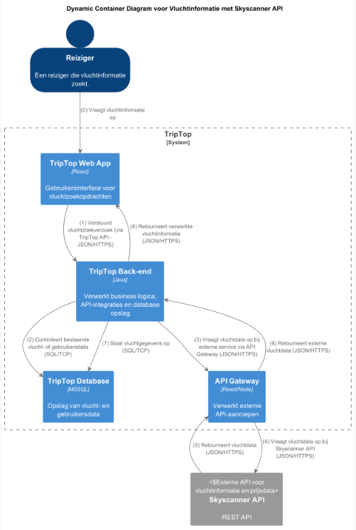

# Software Guidebook Triptop

## 1. Introduction
Dit software guidebook geeft een overzicht van de Triptop-applicatie. Het bevat een samenvatting van het volgende: 
1. De vereisten, beperkingen en principes. 
1. De software-architectuur, met inbegrip van de technologiekeuzes op hoog niveau en de structuur van de software. 
1. De ontwerp- en codebeslissingen die zijn genomen om de software te realiseren.
1. De architectuur van de infrastructuur en hoe de software kan worden geinstalleerd. 

## 2. Context

### 2.1 Gebruikers

De gebruikers van het systeem zijn mensen die een reis willen plannen en boeken via Triptop. In het diagram worden zij aangeduid als **"reiziger"**.  
Daarnaast zijn er medewerkers van (digitale) reisbureaus, aangeduid als **"reisagent"**, die reizigers ondersteunen bij het boeken van hun droomreis.  
Uiteraard zijn er ook bezoekers die gewoon even komen kijken wat de website te bieden heeft. Deze laten we in deze context buiten beschouwing, omdat bijna alle functionaliteiten alleen van toepassing zijn als je daadwerkelijk inlogt en een vakantie boekt.  
Verder geldt dit diagram enkel voor gebruikers; beheerders of andere betrokkenen hebben een andere context.

### 2.2 Functionaliteit & externe systemen

Binnen Triptop zijn verschillende functionaliteiten beschikbaar die het boeken en beleven van een reis ondersteunen. Deze **'bouwstenen'** hebben elk hun eigen functie.  
In het contextdiagram zijn de volgende functionaliteiten opgenomen:

- **Betaalsysteem:** Dit systeem maakt betalingen binnen de applicatie mogelijk, zoals het boeken van een vlucht of het bestellen van tickets voor een museum.
- **Reisaanbieder:** Hier kunnen reizigers vluchten, treinreizen of busreizen naar hun bestemming bekijken en eventueel boeken. Dit betreft voornamelijk de reis naar de vakantiebestemming. Voor lokaal vervoer, zie 'Openbaar vervoer' en 'Autoaanbieder'.
- **Eetaanbieder:** Reizigers kunnen restaurants in de buurt bekijken, inclusief locaties, menukaarten en reviews, om eenvoudig een geschikte eetgelegenheid te vinden.
- **Autoaanbieder:** Biedt reizigers de mogelijkheid om een auto te huren op locatie.
- **Dagbesteding:** Hier zijn bezienswaardigheden in de buurt te vinden, en het is mogelijk om tickets te bestellen voor activiteiten.
- **Openbaar vervoer:** Toont reisschema’s van verschillende opties voor het openbaar vervoer, zodat reizigers eenvoudig hun lokale reis kunnen plannen.
- **Maps Functionaliteit:** Een kaart waarop locaties worden weergegeven, zodat gebruikers kunnen zien waar ze zijn en waar ze naartoe kunnen gaan.
- **Accommodatie:** Hiermee kunnen reizigers hun verblijf regelen, boeken en betalen via de applicatie.

Voor alle functionaliteiten worden externe systemen gebruikt, zodat de functionaliteiten lokaal beschikbaar zijn en gebruikers maximaal comfort ervaren.  
In **hoofdstuk 7** worden de API's verder toegelicht en uitgelegd in de vorm van een **containerdiagram**.

## 3. Functional Overview

Om de belangrijkste features toe te lichten zijn er user stories en twee domain stories gemaakt en een overzicht van het domein in de vorm van een domeinmodel. Op deze plek staat typisch een user story map maar die ontbreekt in dit voorbeeld.

### 3.1 User Stories

#### 3.1.1 User Story 1: Reis plannen

Als gebruiker wil ik een zelfstandig op basis van diverse variabelen (bouwstenen) een reis kunnen plannen op basis van mijn reisvoorkeuren (wel/niet duurzaam reizen, budget/prijsklasse, 's nachts reizen of overdag etc.) zodat ik op vakantie kan gaan zonder dat hiervoor een reisbureau benodigd is.

#### 3.1.2 User Story 2: Reis boeken

Als gebruiker wil ik een geplande reis als geheel of per variabele (bouwsteen) boeken en betalen zodat ik op vakantie kan gaan zonder dat hiervoor een reisbureau benodigd is.

#### 3.1.3 User Story 3: Reis cancelen

Als gebruiker wil ik een geboekte reis, of delen daarvan, kunnen annuleren zodat ik mijn geld terug kan krijgen zonder inmenging van een intermediair zoals een reisbureau.

#### 3.1.4 User Story 4: Reisstatus bewaren 

Als gebruiker wil ik mijn reisstatus kunnen bewaren zonder dat ik een extra account hoef aan te maken zodat ik mijn reis kan volgen zonder dat ik daarvoor extra handelingen moet verrichten.

#### 3.1.5 User Story 5: Bouwstenen flexibel uitbreiden

Als gebruiker wil ik de bouwstenen van mijn reis flexibel kunnen uitbreiden met een zelf te managen stap (bijv. met providers die niet standaard worden aangeboden zoals een andere reisorganisatie, hotelketen etc.) zodat ik mijn reis helemaal kan aanpassen aan mijn wensen.

### 3.2 Domain Story Reis Boeken (AS IS)

### 3.3 Domain Story Reis Boeken (TO BE)

### 3.4 Domain Model

## 4. Quality Attributes

Voordat deze casusomschrijving tot stand kwam, heeft de opdrachtgever de volgende ISO 25010 kwaliteitsattributen benoemd als belangrijk:
* Compatibility -> Interoperability (Degree to which a system, product or component can exchange information with other products and mutually use the information that has been exchanged)
* Reliability -> Fault Tolerance (Degree to which a system or component operates as intended despite the presence of hardware or software faults)
* Maintainability -> Modularity (Degree to which a system or computer program is composed of discrete components such that a change to one component has minimal impact on other components)
* Maintainability -> Modifiability (Degree to which a product or system can be effectively and efficiently modified without introducing defects or degrading existing product quality)
* Security -> Integrity (Degree to which a system, product or component ensures that the state of its system and data are protected from unauthorized modification or deletion either by malicious action or computer error)
* Security -> Confidentiality (Degree to which a system, product or component ensures that data are accessible only to those authorized to have access)

## 5. Constraints

> [!IMPORTANT]
> Beschrijf zelf de beperkingen die op voorhand bekend zijn die invloed hebben op keuzes die wel of niet gemaakt kunnen of mogen worden.

## 6. Principles

> [!IMPORTANT]
> Beschrijf zelf de belangrijkste architecturele en design principes die zijn toegepast in de software.

## 7. Software Architecture

###     7.1. Containers

## Globale applicatie

De gebruiker kan inloggen via 2 wegen. De eigen manier die binnen de triptop accplicatie ontwikkeld is. Of via de facebook API met een facebook account. Dit word verder uitgelegd in 7.2 in een dynamisch Container diagram.
Zodra de gebruiker is ingelogd komt deze op de front-end van de applicatie. Hier aangegeven als 'TripTop web applicatie'. Hier worden de bouwblokken in een interface getoond aan de gebruiker om interactie mogelijk te maken.
Er wordt voor de bouwstenen gebruik gemaakt van externe API's. Zo hebben we de beste functionaliteiten met de meest flexibele en up-to-date data.

#### **Functionele mapping naar API's**

| **Functionaliteit**     | **Externe API**                        | **Beschrijving**                                           |
|------------------------|----------------------------------------|------------------------------------------------------------|
| **Authenticatie** | Facebook Media API | Inloggen en authenticeren van gebruikers.                  |
| **Betalingen** | Paypal API                             | Verwerken van betalingen voor boekingen en tickets.        |
| **Reisaanbieder** | Navitia API                            | Ophalen en boeken van bus- en treinreizen.                 |
|**Vluchtaanbieder**| SkyScanner API                         | Ophalen en boeken van vluchten                             |
| **Eetaanbieder** | Uber Eats Scraper API/ Tripadvisor API | Opvragen van restaurants, menu's en reviews.               |
| **Autoaanbieder** | Booking.com API                        | Ophalen en huren van auto's of fietsen.                    |
| **Dagbesteding** | Booking.com API                        | Ophalen en boeken van activiteiten en bezienswaardigheden. |
| **Openbaar vervoer** | Public Transport API                   | Opvragen van reisschema’s en lokaal OV-informatie.         |
| **Google Maps** | Google Maps API                        | Weergave van locaties en routes.                           |
| **Accommodatie** | Booking.com API                        | Boeken van hotels, hostels en andere accommodaties.        |

#### **modulariteit**
Het moet mogelijk zijn om later meerdere bouwstenen toe te voegen of weg te halen. De bouwstenen dienen dus zelfstandig te kunnen opereren. Google maps is een uitzondering daarop. Deze zou eventueel de routebeschrijving kunnen geven van bijvoorbeeld een restaurant.
Dit wil zeggen dat er geen afhankelijkheden mogen zijn tussen de verschillende blokken. 

Omdat het mogelijk moet zijn om de API's te wisselen indien er dingen veranderen of we voor bepaalde regio's andere API's nodig hebben is het van belang dat er gewerkt word met een hexagonaal design in mind. Voor alle API's zal dus een port gemaakt moeten worden om de modulariteit te garanderen.

###     7.2. Components

#### **Login Container diagram**

Hierboven is de inlog functionaliteit uitgewerkt in het container diagram. Er zijn voor nu 2 opties om in te loggen bij TripTop. Dit kan later uitgebreid worden.

#### inloggen direct op de website.
Om direct in te loggen op de website wordt de 'login-signup' API gebruikt. Deze valideert de login gegevens en geeft aan het einde een jwt token terug. Deze kunnen wij opslaan en controleren in de database. Zo houden wij zelf de gegevens bij van onze gebruiker zonder onze eigen inlog functionaliteit te gebruiken.
Zodra de database kan bevestigen dat de login valide is wordt de gebruiker ingelogd. Indien dit niet het geval is en wel een login en geen registreren request is zal er een foutmelding getoont worden.

#### inloggen met de facebook
Er is een mogelijkheid om in te loggen met een Facebook account. Dit gebeurd doormiddel van de Facebook Media API. Deze verwerkt de login en geeft een acces token. Deze sturen wij zelf weer door naar de Facebook graph API. 
Van uit deze api krijgen we in Json gegevens terug. Dat zijn een ID, een username en een email. Deze neemt de backend op. De backend maakt er vervolgends een JWT-token van en controleerd deze op de database en logt zo de gebruiker in.

--- 

#### **Routeplanning Container Diagram**

Bovenstaand diagram laat zien hoe de routeplanning functionaliteit binnen TripTop is opgebouwd. De gebruiker (of reisagent) vraagt een routeplanning aan via de webapplicatie. De webapplicatie communiceert met de backend via onze eigen API.

De backend controleert of er al routegegevens beschikbaar zijn in de database. Indien nodig vraagt de backend route-informatie op bij externe bronnen via de API Gateway. De API Gateway verwerkt de aanvraag en communiceert met de externe Navitia API.
Proces:

    De gebruiker stuurt een routeaanvraag via de TripTop Web App.
    De backend valideert en checkt bestaande data in de database.
    Bij geen resultaat haalt de backend via de API Gateway nieuwe data op bij de Navitia API.
    De routegegevens worden opgeslagen en teruggestuurd naar de gebruiker.

--- 
#### **Vluchtinformatie Container Diagram**

Bovenstaand diagram laat de werking van het opvragen van vluchtinformatie binnen TripTop zien. Zowel de gebruiker als de reisagent kan vluchtinformatie opvragen via de webapplicatie.

De aanvraag komt altijd eerst bij de backend via onze eigen API. Vervolgens handelt de backend de logica af en controleert bestaande vluchtdata in de database. Wanneer er actuele data nodig is, wordt via de API Gateway een aanvraag naar de externe Skyscanner API gestuurd.
Proces:

    De gebruiker doet een vluchtzoekopdracht via de TripTop Web App.
    De backend controleert bestaande vluchtgegevens in de database.
    Zo nodig haalt de backend via de API Gateway vluchtinformatie op bij Skyscanner.
    De vluchtgegevens worden opgeslagen en teruggestuurd naar de gebruiker.

#### **extrene api connection container diagram**

Het bovenstaande diagram geeft weer hoe de componenten samenwerken voor het ophalen van informatie van externe API's. Hierbij wordt gebruikgemaakt van een interface met de naamconventie **port**. Voor elke externe API wordt een aparte **port**-interface gemaakt. Deze interface zorgt ervoor dat de adapter (aangegeven als **AdapterAPI**) de ontvangen data uit de API in het juiste formaat terugstuurt naar de service.

Omdat niet elke API exact dezelfde informatie in hetzelfde formaat terugstuurt, maken wij gebruik van deze **port**-interface.
Voor elke externe API is er een adapter die op deze **port** "aanklikt". Deze adapter haalt de informatie op zoals de API die aanlevert. Vervolgens formatteert, sorteert en filtert de adapter deze data tot een object (**DTO**) dat de service kan gebruiken. Hoe deze transformatie precies verloopt, verschilt per API, en daarom heeft elke API een eigen adapter.

Bij het aanroepen van API's zijn er altijd dezelfde basishandelingen nodig: inloggen, de API aanroepen en de token controleren. De implementatie van deze stappen is per API verschillend en wordt daarom per adapter geregeld. Omdat de volgorde van deze stappen echter altijd hetzelfde is, maken we gebruik van een abstracte klasse genaamd **ApiCaller**.
Binnen deze abstracte klasse passen we het **Template Method Pattern** toe. Dit betekent dat er een vaste functie is die zelf drie functies aanroept in een vaste volgorde:
1. Inloggen
2. De API aanroepen
3. De token controleren

Omdat deze volgorde vastligt, hoeft in de adapter alleen nog maar de implementatie te worden geschreven voor de functies die specifiek zijn voor de betreffende API. Doordat in de abstracte klasse de volgorde en aanroepen al zijn vastgelegd, levert dit onderhoudbare en uitbreidbare code op.

Het is dus van belang dat je bij het aanmaken van een adaptor zowel de port-interface implementeert en de APICaller extend. Zo krijg je de volledige implementatie voor het toevoegen van een nieuwe API.
Mocht er een compleet nieuwe functionaliteit komen met een nieuwe api is het wel van belang dat er dus een nieuwe port-interface aangemaakt wordt!

### **externe api connection dynamisch diagram**

Dit is het Dynamische diagram dat hoort bij het 

> [!IMPORTANT]
> Voeg toe: Component Diagram plus een Dynamic Diagram van een aantal scenario's inclusief begeleidende tekst.

###     7.3. Design & Code

> [!IMPORTANT]
> Voeg toe: Per ontwerpvraag een Class Diagram plus een Sequence Diagram van een aantal scenario's inclusief begeleidende tekst.

## 8. Architectural Decision Records

> [!IMPORTANT]
> Voeg toe: 3 tot 5 ADR's die beslissingen beschrijven die zijn genomen tijdens het ontwerpen en bouwen van de software.

### 8.1. Eten

## Status
> Voorgesteld

## Context
> Voor de TripTop applicatie is er een externi api nodig voor het vinden van bestellen van eten/drinken.

## Alternatieven

- Uber Eats Scraper API
- The Fork The Spoon
- Tripadvisor
- Restaurants
- Red Flower Business Data

| **Criteria**        | **Uber Eats Scraper API**                                                                | **The Fork The Spoon**                                      | **Tripadvisor**                                                                      | **Restaurants**                                   | **Red Flower Business Data**                                    |
|---------------------|------------------------------------------------------------------------------------------|-------------------------------------------------------------|--------------------------------------------------------------------------------------|---------------------------------------------------|-----------------------------------------------------------------|
| **Gebied**          | ++ Globaal, maar vooral gericht op bepaalde regio's                                      | ++ Globaal                                                  | ++ Globaal                                                                           | ++ Globaal                                        | ++ Globaal                                                      |
| **Bruikbaarheid**   | -- Biedt niet de mogelijkheden die wij nodig hebben voor de applicatie(geen mogelijkheid tot zoeken op locatie) | -- Geeft foutmelding bij het meegeven van de voorbeeld code | 0 Zeer uitgebreid. Je kan makkelijk een lijst aan restaurants krijgen via locationId | - Maakt geen gebruik van JSON                     | - Geeft lege arrays terug als je bepaalde locaties zoekt        |
| **Soorten**         | ++ Veel verschillende soorten restaurants, zoals fastfood, snackbars, cafés, fine dining | + Meer gericht op restaurants en specifieke eetgelegenheden | -- Beperkte soorten en vaak gefocust op grotere ketens                               | -- Beperkt tot algemene restaurant- of eetlocaties | + Diverse eetgelegenheden, met een focus op de lokale markten.  |

## Beslissing

> Voor de applicatie blijkt Tripadvisor het beste te zijn. TripAdvisor biedt de mogelijkheid om restaurants te vinden op basis van een megegeven locatie. Dit is nodig voor de applicatie. Tripdadvisor haalt alleen bekende restaurants op, maar dit is voldoende voor de applicatie de gebouwd wordt.

## Gevolgen

### Positieve gevolgen

- Bij het ophalen van een restaurant wordt veel informatie opgehaald. Hierdoor kan je de gebruiker extra informatie geven en zijn er veel opties voor filteren.
- TripAdviser haalt wereldwijd restaurants op. Zo kunnen over restaurant opties worden weergegeven.
- Betrouwbaarheid van gegevens. Tripadvisor heeft een 100% Service Level. Ook is Tripadvisor een bekend bedrijf waardoor je betrouwbare informatie kan verwachten.
- Tripadvisor biedt ook de mogelijkheid om vliegvelden, vluchten, autoverhuur en hotels. Hierdoor heb je eventueel geen andere API's hiervoor nodig.
### Negatieve gevolgen

- Bij het ophalen van een restaurant wordt veel informatie opgehaald. Deze informatie is vaak niet allemaal nodig waardoor je eigenlijk te veel gegevens ophaald.
- Voor het vinden van restaurants moet je een locationId meegeven. Hierdoor moet je twee GET requests doen. Eén voor het ophalen van de locationId en één voor het ophalen van de restaurants in die omgeving.
- Het is afhankelijk van een locationId. Hierdoor moet je precies weten waar de gebruiker wilt zoeken en kan je niet algemeen zoeken zoals een land of regio.

### 8.2. ADR-002 intergratie PayPal wallet in Triptop
## 1. Titel
**Betalingen bij externe partijen via PayPal Wallet**

## 2. Status
**Voorstel**

## 3. Context
Om bij bepaalde bedrijven of bureaus producten of diensten te kunnen bestellen, moet er een betaalmogelijkheid zijn.

## 4. Beslissing
Om betalingen zo soepel mogelijk te laten verlopen, hebben wij gekozen voor een centrale betaalfunctie binnen Triptop zelf.
Zo kunnen gebruikers overal betalen ongeacht de valuta of de locatie. Niet alle landen accepteren banken uit nederland.
Ook niet iedereen heeft een CreditCard om ergens te betalen of heeft behoefte deze aan te vragen. Om te voorkomen dat mensen tegen betaal problemen aanlopen hebben wij gekozen dit in ons platform te intergreren.

We hebben iDEAL, PayPal en bankoverschrijvingen overwogen en gekozen voor **PayPal** vanwege de wereldwijde beschikbaarheid. PayPal ondersteunt betalingen met creditcards,
het koppelen van bankrekeningen en biedt bovendien de mogelijkheid om je PayPal Wallet op te waarderen met iDEAL.
Hierdoor kunnen ook gebruikers zonder creditcard internationaal betalen.

## 5. Betalingsopties vergelijking

| Forces              | iDEAL | PayPal | Bank |
|---------------------|:-----:|:------:|:----:|
| **Beschikbaarheid** | -   | ++     | 0    |
| **Creditcards**     | --  | ++     | ++   |
| **Betrouwbaarheid** | ++  | +      | ++   |
| **Extra kosten**    | ?   | +      | +    |

## 6. Consequenties

### **Voordelen:**
Het gebruik van paypal heeft de volgende voordelen:

- Betalingen in de wallet kunnen worden opgewaardeerd via iDEAL.
- Ondersteunt creditcards en het koppelen van bankrekeningen.
- Wereldwijd bruikbaar.

### **Nadelen:**
Ook heeft het enkele nadelen:

- PayPal is opgericht door Elon Musk en heeft in het verleden kritiek gekregen op beleid en kosten.
- Externe API vereist integratie en communicatie met andere API’s.
- Niet alle bedrijven accepteren PayPal.

## 7. Alternatieven overwogen

### **Geen betalingen via Triptop**
- **Voordeel:** Eenvoudigere integratie, geen extra betalingslogica nodig.
- **Nadeel:** Gebruikers kunnen mogelijk niet betalen met hun gewenste betaalmethode.

Geen betalingsmogelijkheden van Triptop zelf was een overwogen optie.
We kwamen er achter dat veel landen geen nederlandse pinpassen of bankbetalingen accepteren.
Vooral landen die nog niet echt klaar zijn voor grote vakantieganger

### **iDEAL**
- **Voordeel:** Veelgebruikte betaalmethode in Nederland.
- **Nadeel:** Werkt alleen in Nederland en ondersteunt geen buitenlandse valuta.

### **Bankoverschrijvingen**
- **Voordeel:** Werkt (bijna) overal en is een directe manier van betalen.
- **Nadeel:** Vereist directe bankgegevens en extra beveiligingsmaatregelen.

### 8.2.1 bronnen

ToDo: Toevoegen bronnen

### 8.3. ADR-003 Integratie van de Skyscanner API voor Vluchtinformatie

## 1. Titel
**Integratie van de Skyscanner API voor Vluchtinformatie**

## 2. Status
**Voorstel**

## 3. Context
Onze applicatie moet vluchtinformatie kunnen ophalen voor het plannen van reizen. Skyscanner API biedt uitgebreide vluchtdata. Alternatieven, zoals Kiwi.com of niet-publieke oplossingen zoals Google Flights, zijn minder geschikt voor onze toepassing.

## 4. Beslissing
Wij kiezen voor de Skyscanner API vanwege:
- **Uitgebreide data:** Betrouwbare en actuele vluchtinformatie.
- **Toegankelijkheid:** Eenvoudige integratie met de API.
- **Focus op reisdata:** Specifiek ontworpen voor vluchtzoekopdrachten.

## 5. Consequenties

### Voordelen:
- Kwalitatieve en gedetailleerde vluchtinformatie.
- Eenvoudige API-integratie binnen de Spring Boot applicatie.
- Ondersteuning voor meerdere datapunten zoals prijs en luchtvaartmaatschappij.

### Nadelen:
- Mogelijke beperkingen in verzoeken afhankelijk van het contract.
- Afhankelijkheid van externe data voor kritieke functionaliteit.

## 6. Alternatieven Overwogen

| Kenmerk                  | Skyscanner  | Kiwi.com | 
|--------------------------|-------------|----------|
| **Data Nauwkeurigheid**  | ++          | +        | 
| **Toegankelijkheid**     | ++          | +        | 
| **Documentatie**         | ++          | +        | 
| **Kosten/Kwota**         | +           | ?        |

**Datum:** 21-03-2025  
**Auteur:** Jae Dreijling
--- 

### 8.4. ADR-004 Vergelijking tussen Navitia en Google Maps

## 1. Titel
**Routeplanning: Vergelijking tussen Navitia en Google Maps**

## 2. Status
**> Voorstel**

## 3. Context
Voor de routeplanning in onze applicatie is het noodzakelijk om gebruikers meerdere reismogelijkheden te bieden (zoals auto, openbaar vervoer, fietsen en wandelen). Er zijn twee hoofdopties overwogen:

- **Google Maps API (specifiek de Google Directions API / Routes API):**  
  Bekend om zijn uitgebreide wereldwijde dekking, hoge nauwkeurigheid en uitgebreide documentatie, maar met hogere kosten bij intensief gebruik. Deze API biedt gedetailleerde routeinformatie voor verschillende vervoerswijzen, met name gericht op auto en openbaar vervoer.

- **Navitia API:**  
  Een open platform dat zich richt op multi-modale reisdata, vaak tegen lagere kosten (inclusief een gratis tier) maar met een mogelijk beperkter dekkingsgebied en minder gedetailleerde wereldwijde data.

## 4. Beslissing
Wij kiezen voor de integratie van **Navitia API** als primaire routeplanner, met de mogelijkheid om de **Google Directions API / Routes API** als fallback of aanvullende bron te gebruiken indien er specifieke, wereldwijde data nodig is. Deze beslissing is gebaseerd op de volgende overwegingen:

- **Kosten:** Navitia biedt een aantrekkelijk gratis tier en lagere instapkosten, wat ideaal is voor de initiële ontwikkelfase.
- **Multi-modale routeplanning:** Navitia is specifiek ontworpen voor routes met meerdere vervoerswijzen, wat aansluit bij onze functionele eisen.
- **Uitbreidbaarheid:** Indien we later internationale of zeer gedetailleerde route-informatie nodig hebben, kan de Google Directions API als aanvullende service worden geïntegreerd.

## 5. Consequenties

### Voordelen:
- **Navitia:**
    - Kostenefficiënt voor laag tot matig gebruik.
    - Uitstekende ondersteuning voor multi-modale routes.
    - Flexibele integratie met een duidelijke focus op openbaar vervoer en lokale routes.

- **Google Directions API / Routes API (als fallback):**
    - Hoogwaardige en nauwkeurige data met wereldwijde dekking.
    - Uitgebreide documentatie en ondersteuning.

### Nadelen:
- **Navitia:**
    - Beperkte wereldwijde dekking vergeleken met Google Maps.
    - Mogelijk minder gedetailleerde data in sommige regio’s.

- **Google Directions API / Routes API:**
    - Hogere kosten bij intensief gebruik.
    - Complexere prijsstructuur en quota-beperkingen.

## 6. Alternatieven Overwogen

| Kenmerk                         | Navitia                                                          | Google  Routes API                                                                                  |
|---------------------------------|------------------------------------------------------------------|-----------------------------------------------------------------------------------------------------|
| **Kosten**                      | Laag/Gratis tier                                                 | Duurder (betaal per gebruik)                                                                        |
| **Multi-modale routeplanning**  | Uitstekend, specifiek gericht op openbaar vervoer, fietsen, etc. | Ondersteuning voor auto en openbaar vervoer, maar minder gespecialiseerd in multi-modale integratie |
| **Wereldwijde dekking**         | Regionaal sterk, maar beperkt buiten Europa                      | Uitgebreide wereldwijde dekking                                                                     |
| **Nauwkeurigheid en details**   | Goed, met focus op openbaar vervoer                              | Zeer gedetailleerd en accuraat                                                                      |
| **Documentatie & Support**      | Voldoende, maar minder uitgebreid dan Google Maps                | Uitgebreide en robuuste documentatie en ondersteuning                                               |

## ADR Info
**Datum:** 21-03-2025  
**Auteur:** Jae Dreijling
--- 

> [!TIP]
> These documents have names that are short noun phrases. For example, "ADR 1: Deployment on Ruby on Rails 3.0.10" or "ADR 9: LDAP for Multitenant Integration". The whole ADR should be one or two pages long. We will write each ADR as if it is a conversation with a future developer. This requires good writing style, with full sentences organized into paragraphs. Bullets are acceptable only for visual style, not as an excuse for writing sentence fragments. (Bullets kill people, even PowerPoint bullets.)

#### Context

> [!TIP]
> This section describes the forces at play, including technological, political, social, and project local. These forces are probably in tension, and should be called out as such. The language in this section is value-neutral. It is simply describing facts about the problem we're facing and points out factors to take into account or to weigh when making the final decision.

#### Considered Options

> [!TIP]
> This section describes the options that were considered, and gives some indication as to why the chosen option was selected.

#### Decision

> [!TIP]
> This section describes our response to the forces/problem. It is stated in full sentences, with active voice. "We will …"

#### Status

> [!TIP]
> A decision may be "proposed" if the project stakeholders haven't agreed with it yet, or "accepted" once it is agreed. If a later ADR changes or reverses a decision, it may be marked as "deprecated" or "superseded" with a reference to its replacement.

#### Consequences

> [!TIP]
> This section describes the resulting context, after applying the decision. All consequences should be listed here, not just the "positive" ones. A particular decision may have positive, negative, and neutral consequences, but all of them affect the team and project in the future.

### 8.4. ADR-004 TITLE

> [!TIP]
> These documents have names that are short noun phrases. For example, "ADR 1: Deployment on Ruby on Rails 3.0.10" or "ADR 9: LDAP for Multitenant Integration". The whole ADR should be one or two pages long. We will write each ADR as if it is a conversation with a future developer. This requires good writing style, with full sentences organized into paragraphs. Bullets are acceptable only for visual style, not as an excuse for writing sentence fragments. (Bullets kill people, even PowerPoint bullets.)

#### Context

> [!TIP]
> This section describes the forces at play, including technological, political, social, and project local. These forces are probably in tension, and should be called out as such. The language in this section is value-neutral. It is simply describing facts about the problem we're facing and points out factors to take into account or to weigh when making the final decision.

#### Considered Options

> [!TIP]
> This section describes the options that were considered, and gives some indication as to why the chosen option was selected.

#### Decision

> [!TIP]
> This section describes our response to the forces/problem. It is stated in full sentences, with active voice. "We will …"

#### Status

> [!TIP]
> A decision may be "proposed" if the project stakeholders haven't agreed with it yet, or "accepted" once it is agreed. If a later ADR changes or reverses a decision, it may be marked as "deprecated" or "superseded" with a reference to its replacement.

#### Consequences

> [!TIP]
> This section describes the resulting context, after applying the decision. All consequences should be listed here, not just the "positive" ones. A particular decision may have positive, negative, and neutral consequences, but all of them affect the team and project in the future.

### 8.5. ADR-005 TITLE

> [!TIP]
> These documents have names that are short noun phrases. For example, "ADR 1: Deployment on Ruby on Rails 3.0.10" or "ADR 9: LDAP for Multitenant Integration". The whole ADR should be one or two pages long. We will write each ADR as if it is a conversation with a future developer. This requires good writing style, with full sentences organized into paragraphs. Bullets are acceptable only for visual style, not as an excuse for writing sentence fragments. (Bullets kill people, even PowerPoint bullets.)

#### Context

> [!TIP]
> This section describes the forces at play, including technological, political, social, and project local. These forces are probably in tension, and should be called out as such. The language in this section is value-neutral. It is simply describing facts about the problem we're facing and points out factors to take into account or to weigh when making the final decision.

#### Considered Options

> [!TIP]
> This section describes the options that were considered, and gives some indication as to why the chosen option was selected.

#### Decision

> [!TIP]
> This section describes our response to the forces/problem. It is stated in full sentences, with active voice. "We will …"

#### Status

> [!TIP]
> A decision may be "proposed" if the project stakeholders haven't agreed with it yet, or "accepted" once it is agreed. If a later ADR changes or reverses a decision, it may be marked as "deprecated" or "superseded" with a reference to its replacement.

#### Consequences

> [!TIP]
> This section describes the resulting context, after applying the decision. All consequences should be listed here, not just the "positive" ones. A particular decision may have positive, negative, and neutral consequences, but all of them affect the team and project in the future.

## 9. Deployment, Operation and Support

> [!TIP]
> Zelf beschrijven van wat je moet doen om de software te installeren en te kunnen runnen.