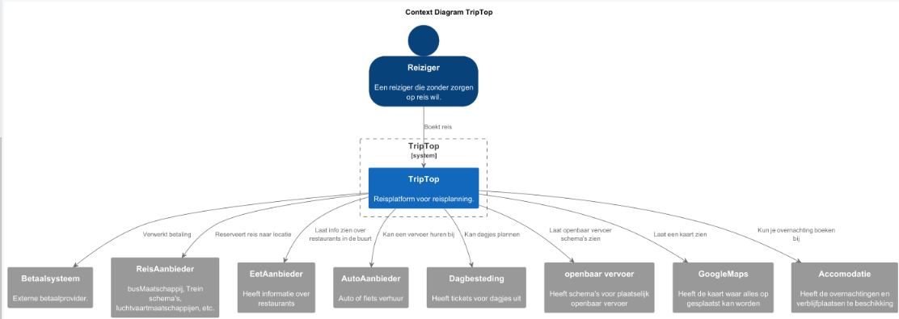
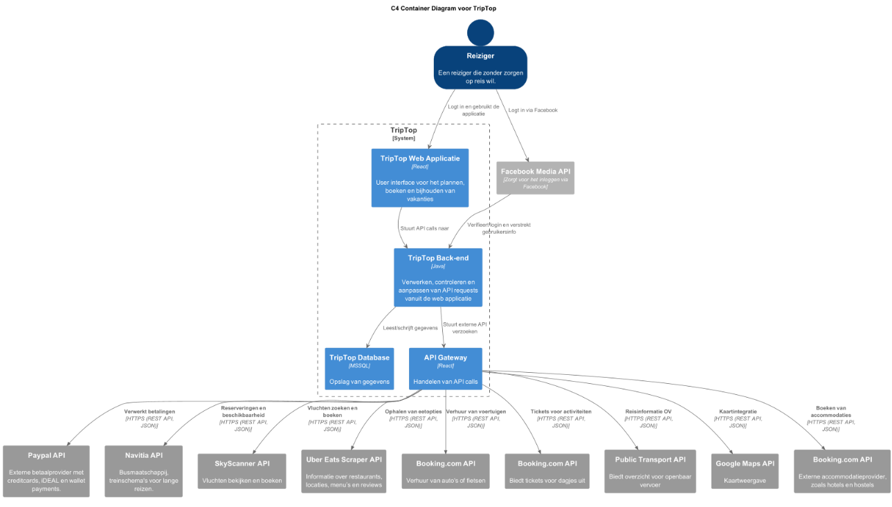
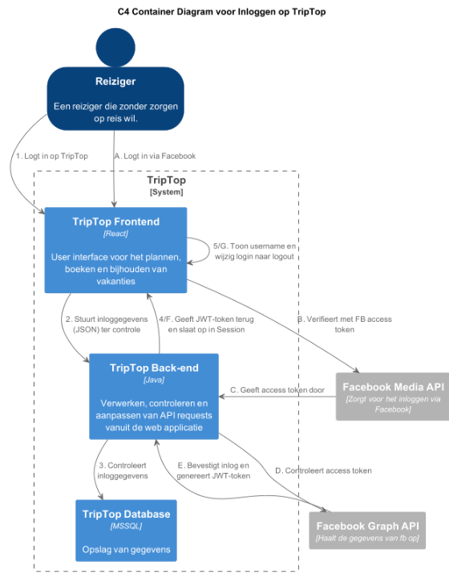
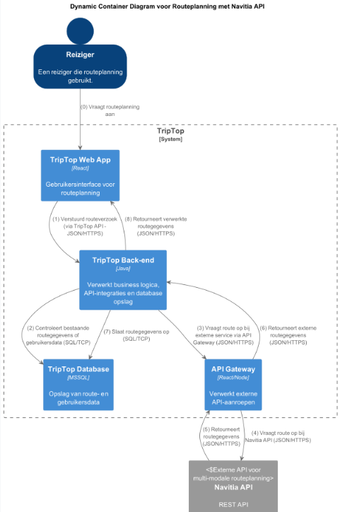
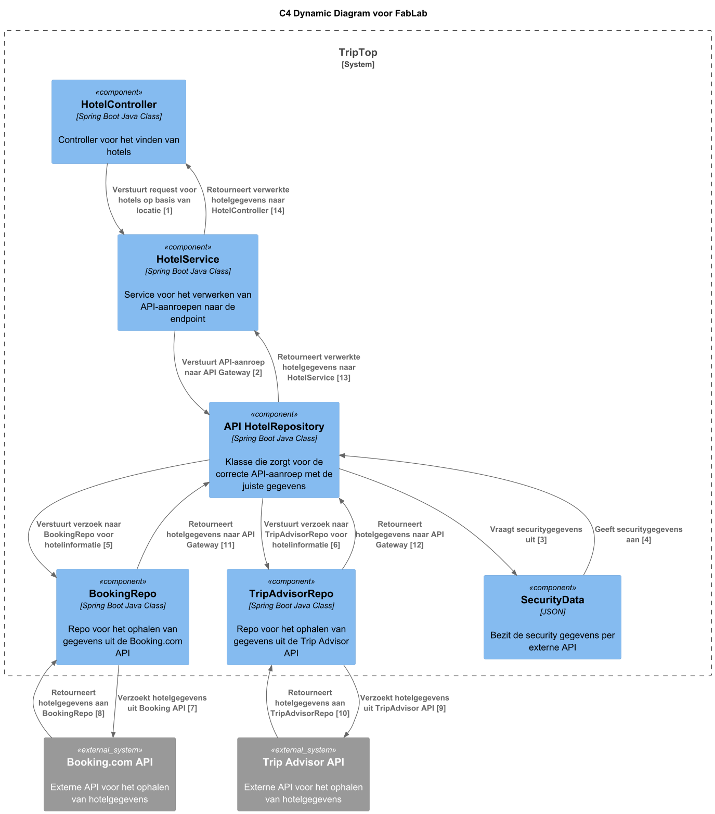
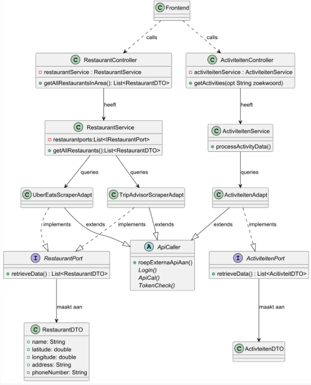

# Software Guidebook Triptop

## 1. Introduction
Dit software guidebook geeft een overzicht van de Triptop-applicatie. Het bevat een samenvatting van het volgende: 
1. De vereisten, beperkingen en principes. 
1. De software-architectuur, met inbegrip van de technologiekeuzes op hoog niveau en de structuur van de software. 
1. De ontwerp- en codebeslissingen die zijn genomen om de software te realiseren.
1. De architectuur van de infrastructuur en hoe de software kan worden geinstalleerd. 

## 2. Context

### 2.1 Gebruikers

De gebruikers van het systeem zijn mensen die een reis willen plannen en boeken via Triptop. In het diagram worden zij aangeduid als **"reiziger"**.  
Daarnaast zijn er medewerkers van (digitale) reisbureaus, aangeduid als **"reisagent"**, die reizigers ondersteunen bij het boeken van hun droomreis. Gezien deze voor nu geen andere functionaliteit heeft word deze in de diagrammen niet weergegeven.  
Uiteraard zijn er ook bezoekers die gewoon even komen kijken wat de website te bieden heeft. Deze laten we in deze context buiten beschouwing, omdat bijna alle functionaliteiten alleen van toepassing zijn als je daadwerkelijk inlogt en een vakantie boekt.  
Verder geldt dit diagram enkel voor gebruikers; beheerders of andere betrokkenen hebben een andere context.

### 2.2 Functionaliteit & externe systemen

Binnen Triptop zijn verschillende functionaliteiten beschikbaar die het boeken en beleven van een reis ondersteunen. Deze **'bouwstenen'** hebben elk hun eigen functie.  
In het contextdiagram staan de volgende functionaliteiten:

- **Betaalsysteem:** Dit systeem maakt betalingen binnen de applicatie mogelijk, zoals het boeken van een vlucht of het bestellen van tickets voor een museum.
- **Reisaanbieder:** Hier kunnen reizigers vluchten, treinreizen of busreizen naar hun bestemming bekijken en eventueel boeken. Dit betreft voornamelijk de reis naar de vakantiebestemming. Voor lokaal vervoer, zie 'Openbaar vervoer' en 'Autoaanbieder'.
- **Eetaanbieder:** Reizigers kunnen restaurants in de buurt bekijken, inclusief locaties, menukaarten en reviews, om eenvoudig een geschikte eetgelegenheid te vinden.
- **Autoaanbieder:** Biedt reizigers de mogelijkheid om een auto te huren op locatie.
- **Dagbesteding:** Hier zijn bezienswaardigheden in de buurt te vinden, en het is mogelijk om tickets te bestellen voor activiteiten.
- **Openbaar vervoer:** Toont reisschema’s van verschillende opties voor het openbaar vervoer, zodat reizigers eenvoudig hun lokale reis kunnen plannen.
- **Maps Functionaliteit:** Een kaart waarop locaties worden weergegeven, zodat gebruikers kunnen zien waar ze zijn en waar ze naartoe kunnen gaan.
- **Accommodatie:** Hiermee kunnen reizigers hun verblijf regelen, boeken en betalen via de applicatie.

Voor alle functionaliteiten worden externe systemen gebruikt, zodat de functionaliteiten lokaal beschikbaar zijn en gebruikers maximaal comfort ervaren.  
In **hoofdstuk 7** worden de API's verder toegelicht en uitgelegd in de vorm van een **containerdiagram**.

## 3. Functional Overview

Om de belangrijkste features toe te lichten zijn er user stories en twee domain stories gemaakt en een overzicht van het domein in de vorm van een domeinmodel. Op deze plek staat typisch een user story map maar die ontbreekt in dit voorbeeld.

### 3.1 User Stories

#### 3.1.1 User Story 1: Reis plannen

Als gebruiker wil ik een zelfstandig op basis van diverse variabelen (bouwstenen) een reis kunnen plannen op basis van mijn reisvoorkeuren (wel/niet duurzaam reizen, budget/prijsklasse, 's nachts reizen of overdag etc.) zodat ik op vakantie kan gaan zonder dat hiervoor een reisbureau benodigd is.

#### 3.1.2 User Story 2: Reis boeken

Als gebruiker wil ik een geplande reis als geheel of per variabele (bouwsteen) boeken en betalen zodat ik op vakantie kan gaan zonder dat hiervoor een reisbureau benodigd is.

#### 3.1.3 User Story 3: Reis cancelen

Als gebruiker wil ik een geboekte reis, of delen daarvan, kunnen annuleren zodat ik mijn geld terug kan krijgen zonder inmenging van een intermediair zoals een reisbureau.

#### 3.1.4 User Story 4: Reisstatus bewaren 

Als gebruiker wil ik mijn reisstatus kunnen bewaren zonder dat ik een extra account hoef aan te maken zodat ik mijn reis kan volgen zonder dat ik daarvoor extra handelingen moet verrichten.

#### 3.1.5 User Story 5: Bouwstenen flexibel uitbreiden

Als gebruiker wil ik de bouwstenen van mijn reis flexibel kunnen uitbreiden met een zelf te managen stap (bijv. met providers die niet standaard worden aangeboden zoals een andere reisorganisatie, hotelketen etc.) zodat ik mijn reis helemaal kan aanpassen aan mijn wensen.

### 3.2 Domain Story Reis Boeken (AS IS)

### 3.3 Domain Story Reis Boeken (TO BE)

### 3.4 Domain Model

## 4. Quality Attributes

Voordat deze casusomschrijving tot stand kwam, heeft de opdrachtgever de volgende ISO 25010 kwaliteitsattributen benoemd als belangrijk:
* Compatibility -> Interoperability (Degree to which a system, product or component can exchange information with other products and mutually use the information that has been exchanged)
* Reliability -> Fault Tolerance (Degree to which a system or component operates as intended despite the presence of hardware or software faults)
* Maintainability -> Modularity (Degree to which a system or computer program is composed of discrete components such that a change to one component has minimal impact on other components)
* Maintainability -> Modifiability (Degree to which a product or system can be effectively and efficiently modified without introducing defects or degrading existing product quality)
* Security -> Integrity (Degree to which a system, product or component ensures that the state of its system and data are protected from unauthorized modification or deletion either by malicious action or computer error)
* Security -> Confidentiality (Degree to which a system, product or component ensures that data are accessible only to those authorized to have access)

## 5. Constraints

> [!IMPORTANT]
> Beschrijf zelf de beperkingen die op voorhand bekend zijn die invloed hebben op keuzes die wel of niet gemaakt kunnen of mogen worden.

## 6. Principles

Tijdens het ontwerpen van de applicatie is er rekening gehouden met verschillende design princaples. 

**Single responsibilty:**

Tijdens het designen van de proto-types hebben zoveel mogelijk rekening proberen te houden met de single responsibilty principle. 
Om dat het soms lastig is om in te schatten wat er precies in de implementaties komt te staan van een functie is het tijdens het maken van de proto-types voorgekomen dat we ons niet helemaal hebben gehouden aan de principle. 

_Voorbeeld_: 

In het prototype voor de port/adapters voor restaurants word er data opgehaald uit de externe api's en daarna omgezet tot een json object en in een dto gedaan. Het ophalen word gedaan door de apiCaller. Het vervormen van de string naar een Object EN het aanmaken van de DTO met die data word afgehandeld in 1 functie.
Deze zouden goed gesplitst kunnen worden om de serpartion of concern te waarborgen. 
 
Voor het uitendelijke uitwerken van de applicatie is het van belang dat hier wel aan gehouden wordt.

**open closed**

Het open/closed principle word uitgebried gebruikt op verschillende plaatsen. Het onderhoudbaar en uitbreidbaar maken van de code was een groot onderdeel van het ontwerp. 
Omdat het open/closed principe hier veel focus op legt was dit voor ons niet te missen. We maken hier dan ook veel gebruik van.

_Voorbeeld_: 

In het prototype restaurantService word de IRestaurant aangeroepen om de data op te halen en te vervormen. Dit wordt niet gedaan per elke adapter los aan te roepen op de directe implementatie maar de IRestaurant interface.
Zo worden alle vormen van de implementaties aangeroepen die in de lijst zitten. Ook als er een nieuwe implementatie bijkomt word deze automatisch meegenomen zonder de code te hoeven veranderen.
Door gebruik te maken van **@Autowired** boven de lijst met die api's en de implementaties **@Component** mee te geven worden deze automatisch toegevoegd aan de desbetreffende lijst. Zo hoef je niet eens meer iets te voegen aan de lijst als er een nieuwe implementatie van komt. Dit zorgt voor een nog meer open/closed codebase.

Interface Segregation Principle (ISP)

Het Interface Segregation Principle (ISP) is bedoeld om te voorkomen dat een klasse onnodige functies moet implementeren om te voldoen aan een interface. Om dit te voorkomen is het belangrijk dat interfaces alleen de methoden bevatten die voor hun specifieke taak nodig zijn en niet meer. Zoals eerder besproken bij **Single Responsibility Principle**, kan een functie opgesplitst worden in verschillende kleinere functies, zoals makeJsonObject() en makeDTORecords().

Om te voorkomen dat je deze methoden ook moet implementeren in alle implementaties van de IRestaurant interface, kun je deze functies beter lokaal neerzetten, in plaats van dit overal in elke implementatie te doen. Dit geldt ook voor specifieke DTO's voor die API of wanneer je meer nodig hebt van die API dan gebruikelijk is.

**Dependency Inversion Principle**

Ook wel bekend als **Programming to an interface**. Dit combineert eigenlijk perfect met het **Open/closed principle**. Het maakt dat je niet op de implementatie van van een interface programeerd maar op de interface zelf. Zo worden alle vormen van deze interface die beschikbaar zijn voor die functie aangeroepen. Zie **Open/Closed** voor een mooi voorbeeld.

> [!IMPORTANT]
> Beschrijf zelf de belangrijkste architecturele en design principes die zijn toegepast in de software.

## 7. Software Architecture

###     7.1. Containers

## Globale TripTop applicatie

De gebruiker kan inloggen via 2 wegen. De eigen manier die binnen de triptop accplicatie ontwikkeld is. Of via de facebook API met een facebook account. Dit word verder uitgelegd in 7.2 in een dynamisch Container diagram.
Zodra de gebruiker is ingelogd komt deze op de front-end van de applicatie. Hier aangegeven als 'TripTop web applicatie'. Hier worden de bouwblokken in een interface getoond aan de gebruiker om interactie mogelijk te maken.
Er wordt voor de bouwstenen gebruik gemaakt van externe API's. Zo hebben we de beste functionaliteiten met de meest flexibele en up-to-date data.

#### **Functionele mapping naar API's**

| **Functionaliteit**     | **Externe API**                        | **Beschrijving**                                           |
|------------------------|----------------------------------------|------------------------------------------------------------|
| **Authenticatie** | Facebook Media API | Inloggen en authenticeren van gebruikers.                  |
| **Betalingen** | Paypal API                             | Verwerken van betalingen voor boekingen en tickets.        |
| **Reisaanbieder** | Navitia API                            | Ophalen en boeken van bus- en treinreizen.                 |
|**Vluchtaanbieder**| SkyScanner API                         | Ophalen en boeken van vluchten                             |
| **Eetaanbieder** | Uber Eats Scraper API/ Tripadvisor API | Opvragen van restaurants, menu's en reviews.               |
| **Autoaanbieder** | Booking.com API                        | Ophalen en huren van auto's of fietsen.                    |
| **Dagbesteding** | Booking.com API                        | Ophalen en boeken van activiteiten en bezienswaardigheden. |
| **Openbaar vervoer** | Public Transport API                   | Opvragen van reisschema’s en lokaal OV-informatie.         |
| **Google Maps** | Google Maps API                        | Weergave van locaties en routes.                           |
| **Accommodatie** | Booking.com API                        | Boeken van hotels, hostels en andere accommodaties.        |

#### **modulariteit**
Het moet mogelijk zijn om later meerdere bouwstenen toe te voegen of weg te halen. De bouwstenen dienen dus zelfstandig te kunnen opereren. Google maps is een uitzondering daarop. Deze zou eventueel de routebeschrijving kunnen geven van bijvoorbeeld een restaurant.
Dit wil zeggen dat er geen afhankelijkheden mogen zijn tussen de verschillende blokken. 

Omdat het mogelijk moet zijn om de API's te wisselen indien er dingen veranderen of we voor bepaalde regio's andere API's nodig hebben is het van belang dat er gewerkt word met een hexagonaal design in mind. Voor alle API's zal dus een port gemaakt moeten worden om de modulariteit te garanderen.

###     7.2. Components

#### **Login Container diagram**

Hierboven is de inlog functionaliteit uitgewerkt in het container diagram. Er zijn voor nu 2 opties om in te loggen bij TripTop. Dit kan later uitgebreid worden.

#### inloggen direct op de website.
Om direct in te loggen op de website wordt de 'login-signup' API gebruikt. Deze valideert de login gegevens en geeft aan het einde een jwt token terug. Deze kunnen wij opslaan en controleren in de database. Zo houden wij zelf de gegevens bij van onze gebruiker zonder onze eigen inlog functionaliteit te gebruiken.
Zodra de database kan bevestigen dat de login valide is wordt de gebruiker ingelogd. Indien dit niet het geval is en wel een login en geen registreren request is zal er een foutmelding getoont worden.

#### inloggen met de facebook
Er is een mogelijkheid om in te loggen met een Facebook account. Dit gebeurd doormiddel van de Facebook Media API. Deze verwerkt de login en geeft een acces token. Deze sturen wij zelf weer door naar de Facebook graph API. 
Van uit deze api krijgen we in Json gegevens terug. Dat zijn een ID, een username en een email. Deze neemt de backend op. De backend maakt er vervolgends een JWT-token van en controleerd deze op de database en logt zo de gebruiker in.

--- 

#### **Routeplanning Container Diagram**

Bovenstaand diagram laat zien hoe de routeplanning functionaliteit binnen TripTop is opgebouwd. De gebruiker (of reisagent) vraagt een routeplanning aan via de webapplicatie. De webapplicatie communiceert met de backend via onze eigen API.

De backend controleert of er al routegegevens beschikbaar zijn in de database. Indien nodig vraagt de backend route-informatie op bij externe bronnen via de API Gateway. De API Gateway verwerkt de aanvraag en communiceert met de externe Navitia API.
Proces:

    De gebruiker stuurt een routeaanvraag via de TripTop Web App.
    De backend valideert en checkt bestaande data in de database.
    Bij geen resultaat haalt de backend via de API Gateway nieuwe data op bij de Navitia API.
    De routegegevens worden opgeslagen en teruggestuurd naar de gebruiker.

--- 
#### **Vluchtinformatie Container Diagram**

Bovenstaand diagram laat de werking van het opvragen van vluchtinformatie binnen TripTop zien. Zowel de gebruiker als de reisagent kan vluchtinformatie opvragen via de webapplicatie.

De aanvraag komt altijd eerst bij de backend via onze eigen API. Vervolgens handelt de backend de logica af en controleert bestaande vluchtdata in de database. Wanneer er actuele data nodig is, wordt via de API Gateway een aanvraag naar de externe Skyscanner API gestuurd.
Proces:

    De gebruiker doet een vluchtzoekopdracht via de TripTop Web App.
    De backend controleert bestaande vluchtgegevens in de database.
    Zo nodig haalt de backend via de API Gateway vluchtinformatie op bij Skyscanner.
    De vluchtgegevens worden opgeslagen en teruggestuurd naar de gebruiker.

#### **externe api connection restaurant en activiteit component/ Container diagram**

Een simpel container diagram waarin de reiziger een aanvraag doet via de frontend voor een lijst met restaurants en de bijpassende informatie. De frontend verwerkt deze aanvraag en geeft deze met eventuele parameters voor aan de backend. 
Hier wordt gekeken welke API's er beschikbaar zijn en deze worden aangeroepen en de informatie wordt opgehaald en getoond aan de reiziger. Het aantal Api's wat hier gebruikt kan worden is eindeloos.

Het bovenstaande diagram geeft weer hoe de componenten samenwerken voor het ophalen van informatie van externe API's. Hierbij wordt gebruikgemaakt van een interface met de naamconventie **port**. Voor elke externe API wordt een aparte **port**-interface gemaakt. Deze interface zorgt ervoor dat de adapter (aangegeven als **AdapterAPI**) de ontvangen data uit de API in het juiste formaat terugstuurt naar de service.

Omdat niet elke API exact dezelfde informatie in hetzelfde formaat terugstuurt, maken wij gebruik van deze **port**-interface.
Voor elke externe API is er een adapter die op deze **port** "aanklikt". Deze adapter haalt de informatie op zoals de API die aanlevert. Vervolgens formatteert, sorteert en filtert de adapter deze data tot een object (**DTO**) dat de service kan gebruiken. Hoe deze transformatie precies verloopt, verschilt per API, en daarom heeft elke API een eigen adapter.

Bij het aanroepen van API's zijn er altijd dezelfde basishandelingen nodig: inloggen, de API aanroepen en de token controleren. De implementatie van deze stappen is per API verschillend en wordt daarom per adapter geregeld. Omdat de volgorde van deze stappen echter altijd hetzelfde is, maken we gebruik van een abstracte klasse genaamd **ApiCaller**.
Binnen deze abstracte klasse passen we het **Template Method Pattern** toe. Dit betekent dat er een vaste functie is die zelf drie functies aanroept in een vaste volgorde:
1. Inloggen
2. De API aanroepen
3. De token controleren

Omdat deze volgorde vastligt, hoeft in de adapter alleen nog maar de implementatie te worden geschreven voor de functies die specifiek zijn voor de betreffende API. Doordat in de abstracte klasse de volgorde en aanroepen al zijn vastgelegd, levert dit onderhoudbare en uitbreidbare code op.

Het is dus van belang dat je bij het aanmaken van een adaptor zowel de port-interface implementeert en de APICaller extend. Zo krijg je de volledige implementatie voor het toevoegen van een nieuwe API.
Mocht er een compleet nieuwe functionaliteit komen met een nieuwe api is het wel van belang dat er dus een nieuwe port-interface aangemaakt wordt!

### **externe api connection dynamisch en sequentie diagram**

Dit is het Dynamische diagram dat hoort bij het externe api component diagram. 
Zoals te zien is komt de aanvraag uit de frontend en wordt doorgegeven door de backend tot de service. Deze roept 1 of meerdere adapters aan afhankelijk van de hoeveelheid api's en of dat er een specefieke gevraagd wordt.
Zodra de adapter de aanvraag krijgt gaat hij de api aanroepen met de voorgaand genoemde stappen. De api geeft informatie terug in een format die kan verschillen per api. De adapter zet het daarna weer om naar de juiste format en geeft het terug aan de serive die de aanvraag deed.
De service kan dan ermee doen wat het moet. Dit is verder voor het diagram niet meer van belang. Het gaat in deze om de werking van de connectie met de externe API's.

In dit voorbeeld is gebruik gemaakt van UberEats en TripTop. Dit is uitbreidbaar of verwisselbaar.

In dit diagram is te zien dat de data die de adapters ophalen in dit voorbeeld beide een JSON-object zijn. Binnen de Adapters worden alle antwoorden omgezet naar een String om zo alle vormen van returnwaarde te kunnen gebruiken. Als alles omgezet is tot een String zet de functie dit om naar een **RestaurantDTO** met daarin de informatie die we willen laten zien in aan de gebruiker.
Als de data in een DTO zit worden deze toegevoegd aan de Lijst die uiteindelijk teruggegeven wordt aan de service.

Verder is goed te zien dat het een for-loop is die de adapters afloopt en de data aan de lijst toevoegd. Voor latere implementatie is een **ASync** iets wat ge-implementeert moet worden. Zo hoeft de gebruiker niet te wachten op 1 langezame API. 

#### **externe api connection transport component diagram**

Het onderstaande diagram geeft weer hoe de componenten samenwerken voor het ophalen van informatie van externe API's binnen de TripTop-applicatie.

De TransportProviderPort interface definieert een standaard manier om transportdata op te halen, ongeacht de externe API. Elk van de API-adapters (NavitiaAdapter, GoogleMapsAdapter, SkyscannerAdapter) implementeert deze interface en zorgt ervoor dat de ontvangen data uit de API correct wordt geformatteerd voordat het naar de service wordt gestuurd.

Omdat niet elke API dezelfde gegevensstructuur hanteert, hebben we deze gestandaardiseerde port-interface nodig. De adapters koppelen zich aan deze interface en halen ruwe API-data op, die vervolgens wordt geformatteerd, gesorteerd en gefilterd tot een bruikbaar DTO-object. Dit voorkomt dat de interne service direct afhankelijk is van specifieke API-details.

Bij het aanroepen van API’s moeten altijd dezelfde basishandelingen worden uitgevoerd:

    Inloggen,

    De API aanroepen,

    De token controleren.

De ApiCaller abstracte klasse (zichtbaar in het diagram) zorgt ervoor dat deze stappen altijd in dezelfde volgorde worden uitgevoerd. Dit volgt het Template Method Pattern, waarbij een vaste functie de drie stappen in de juiste volgorde aanroept.

Elke API-adapter, zoals NavitiaAdapter, GoogleMapsAdapter, en SkyscannerAdapter, extends de abstracte klasse ApiCaller. Hierdoor hoeven ontwikkelaars alleen de specifieke implementatie te schrijven voor elke externe API, terwijl de vaste volgorde behouden blijft. Dit maakt de code onderhoudbaar en uitbreidbaar.

Het toevoegen van een nieuwe API vereist twee stappen:

    Een nieuwe port-interface aanmaken als de API-functionaliteit afwijkt van bestaande ports.

    Een nieuwe adapter schrijven die zowel TransportProviderPort implementeert als ApiCaller uitbreidt.

Hierdoor blijft de architectuur modulair en flexibel, terwijl TransportService via TransportProviderSelector automatisch de juiste provider kiest op basis van de aanvraag.

### **externe api connection transport sequence diagram**

Dit is het dynamische diagram dat hoort bij het externe API-component.
De aanvraag komt vanuit de frontend en wordt doorgestuurd naar de backend.
De backend roept de service aan, die een geschikte provider selecteert op basis van de aanvraag.
De juiste adapter roept vervolgens de externe API aan en ontvangt een antwoord in een API-specifiek formaat.
De adapter zet dit om naar een uniform formaat en stuurt het terug naar de service.
De service handelt het verzoek verder af en stuurt de respons terug naar de gebruiker.

### **Consistente authorisatie en authenticatie**

> Om ervoor te zorgen dat de beveiliging consistent is wordt er gebruik gemaakt van een API Gateway. Deze gateway zorgt ervoor dat de communicatie met externe APIs uniform loopt. In de geval zijn er twee externe APIs geschetst. Dit zou uitgebreid kunnen worden naar hoeveel er nodig zijn. 

> In de dynamic diagram is te zien in welke volgorde de communicatie loopt. In deze diagram is de SecurityData apart gezet om in beeld te brengen hoe de API Gateway de security gegevens ophaalt. Voor dit prototype is er gekozen om de waardes hard coded op te slaan. Als dit daadwerkelijk in een project zou geïntegreerd worden dan zullen deze gegevens gehasht in een database moeten staan.

> [!IMPORTANT]
> Voeg toe: Component Diagram plus een Dynamic Diagram van een aantal scenario's inclusief begeleidende tekst.

###     7.3. Design & Code

#### **class diagram exteren api's**

In dit klassediagram kijken we vooral naar het onderste deel van het diagram. Hier is duidelijk hoe de interfaces en abstracte classes invloed hebben op de adaptor-klasse, aangegeven als de 'implamentatie'.  
De ApiCaller heeft een functie roepExterneApiaan. Deze maakt gebruikt van de **Template Method Pattern** door vast te stellen in een niet abstracte klasse dat de volgorde van aanroep login(), dan apiCall() en als laatste checkToken(). 
De implementatie van deze functies wordt gedaan per adaptor gezien elke externe api een eigen aanroepadres en key heeft. 

De service kan dus meerdere adaptors aanroepen. Om ons te houden aan het **open closed principale** wordt er binnen de service gebruik gemaakt van **program to an inferface principal**. In de service wordt niet elke vorm van bij restaurantPort los aangeroepen. Je roept hier alle restaurant ports aan door een simpele restaurantPort.fetchData().
Zo hoeven we niet voor elke port een langer of nieuwe aanroep te maken in de service. Zo blijft de code onderhoudbaar en betrouwbaar omdat je geen aanpassingen kunt vergeten. Zoals eerder besproken heeft elke adaptor zijn eigen implementatie voor het formateren van de data.

De activiteiten-Kant van het diagram is niet geimplementeerd in het proto-type. Dit heeft als reden dat het geen betrekking had op verder bewijs of de **adapter pattern** voldeed aan de verwachten die waren gesteld in ADR (XXXXXXX). Het is wel opgenomen in het klassediagram omdat het wel goed laat zien hoe er nog andere soorten api's makkelijk geimplementeerd kunnen worden en dat de apiCaller een algemene klasse is voor alle klasse die een api aan gaan roepen.

#### **class diagram transport api's**

In dit klassediagram kijken we vooral naar de interacties tussen de interfaces, abstracte klassen en de concrete adapter-klassen. Dit diagram laat duidelijk zien hoe het Template Method Pattern wordt toegepast in de abstracte klasse ApiCaller. De functie callApi() wordt aangeroepen door de adaptors, en zorgt ervoor dat de volgorde van de aanroepen — login(), apiCall(), en checkToken() — consistent wordt uitgevoerd, ongeacht welke externe API wordt aangesproken. Elke concrete adapter, zoals NavitiaAdapter, GoogleMapsAdapter, en SkyscannerAdapter, zorgt ervoor dat de specifieke implementatie van deze stappen wordt uitgevoerd, afhankelijk van de API-vereisten.

De TransportService klasse maakt gebruik van de TransportProviderPort interface, die door de concrete adaptors wordt geïmplementeerd. Deze interface zorgt ervoor dat de service kan communiceren met verschillende API-adapters zonder zich zorgen te maken over de specifieke implementatie van elke API. De service roept fetchData() aan via de TransportProviderPort interface, waardoor de code eenvoudig en uitbreidbaar blijft.

Door gebruik te maken van het Program to an Interface Principle, zorgt de TransportService ervoor dat de communicatie met de adapters generiek en flexibel blijft. Dit betekent dat de service geen specifieke implementaties van API’s aanroept, maar alleen afhankelijk is van de interfaces. Dit voorkomt dat de service code moet worden aangepast voor elke nieuwe API, wat de code onderhoudbaar en betrouwbaar maakt.

Tot slot, door deze ontwerpprincipes en patronen toe te passen, kunnen we de API’s in de toekomst gemakkelijk uitbreiden zonder dat de bestaande codebehoeften aangepast hoeven te worden, wat bijdraagt aan een schaalbaar en flexibel systeemontwerp.

> [!IMPORTANT]
> Voeg toe: Per ontwerpvraag een Class Diagram plus een Sequence Diagram van een aantal scenario's inclusief begeleidende tekst.

## 8. Architectural Decision Records

> [!IMPORTANT]
> Voeg toe: 3 tot 5 ADR's die beslissingen beschrijven die zijn genomen tijdens het ontwerpen en bouwen van de software.

### 8.1. Eten

## Status
> Voorgesteld

## Context
> Voor de TripTop applicatie is er een externi api nodig voor het vinden van bestellen van eten/drinken.

## Alternatieven

- Uber Eats Scraper API
- The Fork The Spoon
- Tripadvisor
- Restaurants
- Red Flower Business Data

| **Criteria**        | **Uber Eats Scraper API**                                                                | **The Fork The Spoon**                                      | **Tripadvisor**                                                                      | **Restaurants**                                   | **Red Flower Business Data**                                    |
|---------------------|------------------------------------------------------------------------------------------|-------------------------------------------------------------|--------------------------------------------------------------------------------------|---------------------------------------------------|-----------------------------------------------------------------|
| **Gebied**          | ++ Globaal, maar vooral gericht op bepaalde regio's                                      | ++ Globaal                                                  | ++ Globaal                                                                           | ++ Globaal                                        | ++ Globaal                                                      |
| **Bruikbaarheid**   | -- Biedt niet de mogelijkheden die wij nodig hebben voor de applicatie(geen mogelijkheid tot zoeken op locatie) | -- Geeft foutmelding bij het meegeven van de voorbeeld code | 0 Zeer uitgebreid. Je kan makkelijk een lijst aan restaurants krijgen via locationId | - Maakt geen gebruik van JSON                     | - Geeft lege arrays terug als je bepaalde locaties zoekt        |
| **Soorten**         | ++ Veel verschillende soorten restaurants, zoals fastfood, snackbars, cafés, fine dining | + Meer gericht op restaurants en specifieke eetgelegenheden | -- Beperkte soorten en vaak gefocust op grotere ketens                               | -- Beperkt tot algemene restaurant- of eetlocaties | + Diverse eetgelegenheden, met een focus op de lokale markten.  |

## Beslissing

> Voor de applicatie blijkt Tripadvisor het beste te zijn. TripAdvisor biedt de mogelijkheid om restaurants te vinden op basis van een megegeven locatie. Dit is nodig voor de applicatie. Tripdadvisor haalt alleen bekende restaurants op, maar dit is voldoende voor de applicatie de gebouwd wordt.

## Gevolgen

### Positieve gevolgen

- Bij het ophalen van een restaurant wordt veel informatie opgehaald. Hierdoor kan je de gebruiker extra informatie geven en zijn er veel opties voor filteren.
- TripAdviser haalt wereldwijd restaurants op. Zo kunnen over restaurant opties worden weergegeven.
- Betrouwbaarheid van gegevens. Tripadvisor heeft een 100% Service Level. Ook is Tripadvisor een bekend bedrijf waardoor je betrouwbare informatie kan verwachten.
- Tripadvisor biedt ook de mogelijkheid om vliegvelden, vluchten, autoverhuur en hotels. Hierdoor heb je eventueel geen andere API's hiervoor nodig.
### Negatieve gevolgen

- Bij het ophalen van een restaurant wordt veel informatie opgehaald. Deze informatie is vaak niet allemaal nodig waardoor je eigenlijk te veel gegevens ophaald.
- Voor het vinden van restaurants moet je een locationId meegeven. Hierdoor moet je twee GET requests doen. Eén voor het ophalen van de locationId en één voor het ophalen van de restaurants in die omgeving.
- Het is afhankelijk van een locationId. Hierdoor moet je precies weten waar de gebruiker wilt zoeken en kan je niet algemeen zoeken zoals een land of regio.

### 8.2. ADR-002 intergratie PayPal wallet in Triptop
## 1. Titel
**Betalingen bij externe partijen via PayPal Wallet**

## 2. Status
**Voorstel**

## 3. Context
Om bij bepaalde bedrijven of bureaus producten of diensten te kunnen bestellen, moet er een betaalmogelijkheid zijn.

## 4. Beslissing
Om betalingen zo soepel mogelijk te laten verlopen, hebben wij gekozen voor een centrale betaalfunctie binnen Triptop zelf.
Zo kunnen gebruikers overal betalen ongeacht de valuta of de locatie. Niet alle landen accepteren banken uit nederland.
Ook niet iedereen heeft een CreditCard om ergens te betalen of heeft behoefte deze aan te vragen. Om te voorkomen dat mensen tegen betaal problemen aanlopen hebben wij gekozen dit in ons platform te intergreren.

We hebben iDEAL, PayPal en bankoverschrijvingen overwogen en gekozen voor **PayPal** vanwege de wereldwijde beschikbaarheid. PayPal ondersteunt betalingen met creditcards,
het koppelen van bankrekeningen en biedt bovendien de mogelijkheid om je PayPal Wallet op te waarderen met iDEAL.
Hierdoor kunnen ook gebruikers zonder creditcard internationaal betalen.

## 5. Betalingsopties vergelijking

| Forces                          | iDEAL  | PayPal | Bank  |
|----------------------------------|:------:|:------:|:-----:|
| **Internationale beschikbaarheid** | --     | ++     | +     |
| **Uptime**                       | ++     | ++     | +     |
| **Creditcards**                  | --     | ++     | ++    |
| **Betrouwbaarheid**              | ++     | +      | ++    |
| **Beveiliging**                  | ++     | ++     | +     |
| **Extra kosten**                 | 0      | +      | +     |

## 6. Consequenties

### **Voordelen:**
Het gebruik van paypal heeft de volgende voordelen:

- Betalingen in de wallet kunnen worden opgewaardeerd via iDEAL.
- Ondersteunt creditcards en het koppelen van bankrekeningen.
- Wereldwijd bruikbaar.

### **Nadelen:**
Ook heeft het enkele nadelen:

- PayPal is opgericht door Elon Musk en heeft in het verleden kritiek gekregen op beleid en kosten.
- Externe API vereist integratie en communicatie met andere API’s.
- Het is een betaalde API en zal dus geld kosten.
- Niet alle bedrijven accepteren PayPal.

## 7. Alternatieven overwogen

### **Geen betalingen via Triptop**
- **Voordeel:** Eenvoudigere integratie, geen extra betalingslogica nodig.
- **Nadeel:** Gebruikers kunnen mogelijk niet betalen met hun gewenste betaalmethode.

Geen betalingsmogelijkheden van Triptop zelf was een overwogen optie.
We kwamen er achter dat veel landen geen nederlandse pinpassen of bankbetalingen accepteren.
Vooral landen die nog niet echt klaar zijn voor grote vakantieganger

### **iDEAL**
- **Voordeel:** Veelgebruikte betaalmethode in Nederland.
- **Nadeel:** Werkt alleen in Nederland en ondersteunt geen buitenlandse valuta.

### **Bankoverschrijvingen**
- **Voordeel:** Werkt (bijna) overal en is een directe manier van betalen.
- **Nadeel:** Vereist directe bankgegevens en extra beveiligingsmaatregelen.

### 8.2.1 bronnen

ToDo: Toevoegen bronnen

## ADR-003: Integratie van Flightinformatie API’s voor Vluchtinformatie

### 1. Titel
**Integratie van Flightinformatie API’s: Skyscanner, Kiwi.com en Amadeus API**

### 2. Status
**Voorstel**

### 3. Context
Onze applicatie moet vluchtinformatie ophalen voor het plannen van reizen. Het is van belang dat de bron betrouwbaar, actueel en eenvoudig te integreren is. We overwegen daarom de volgende drie API-opties:

- **Skyscanner API:** Biedt uitgebreide en gedetailleerde vluchtdata en heeft een goede reputatie in de reisbranche.
- **Kiwi.com API:** Een alternatief met redelijke datakwaliteit, maar met minder uitgebreide documentatie en support.
- **Amadeus API:** Een bijkomende optie met competitieve kosten en uitgebreide functionaliteiten. Let wel: Google Flights is geen optie, aangezien Google geen publieke API aanbiedt voor vluchtinformatie ([Google Flights](https://www.google.com/flights)).

### 4. Beslissing
Wij kiezen als primaire bron voor vluchtinformatie voor de **Skyscanner API** vanwege:

- **Uitgebreide en betrouwbare data:** Skyscanner levert een rijke dataset en real-time informatie ([Skyscanner API Documentation](https://developers.skyscanner.net)).
- **Eenvoudige integratie:** Duidelijke en gestructureerde documentatie maakt de implementatie soepel.
- **Marktleiderschap en transparantie:** De API is breed geaccepteerd binnen de reisindustrie.

Als secundaire bronnen worden **Kiwi.com API** en **Amadeus API** overwogen. Deze alternatieven helpen om afhankelijkheidsrisico’s te spreiden en bieden potentieel interessante prijs- en functionaliteitsprofielen ([Kiwi.com API Documentatie](https://docs.kiwi.com), [Amadeus for Developers](https://developers.amadeus.com)).

### 5. Consequenties

#### Voordelen
- **Skyscanner API:**
  - Hoge nauwkeurigheid en uitgebreide data.
  - Eenvoudige integratie binnen onze applicatie.
- **Kiwi.com API:**
  - Kan een kosteneffectief alternatief bieden.
- **Amadeus API:**
  - Competitief prijsmodel en uitgebreide functies.

#### Nadelen
- **Skyscanner API:**
  - Mogelijke beperkingen in request quotas en contractuele voorwaarden.
- **Kiwi.com API:**
  - Minder uitgebreide documentatie en support.
- **Amadeus API:**
  - Minder bekend binnen onze markt, wat invloed kan hebben op adoptie en integratie.

### 6. Alternatieven Overwogen

| Kenmerk                  | Skyscanner        | Kiwi.com           | Amadeus API          |
|--------------------------|-------------------|--------------------|----------------------|
| **Data Nauwkeurigheid**  | ++                | +                  | ++                   |
| **Toegankelijkheid**     | ++                | +                  | +                    |
| **Documentatie**         | ++                | +                  | +                    |
| **Kosten/Kwota**         | +                 | ?                  | +                    |

### 7. Bronnen
- [Skyscanner API Documentation](https://developers.skyscanner.net)
- [Kiwi.com API Documentatie](https://docs.kiwi.com)
- [Amadeus for Developers](https://developers.amadeus.com)
- Google Flights biedt geen publieke API voor vluchtinformatie ([Google Flights](https://www.google.com/flights))

**Datum:** 21-03-2025  
**Auteur:** Jae Dreijling

---

## ADR-004: Routeplanning – Vergelijking tussen Navitia en Google Maps

### 1. Titel
**Routeplanning: Vergelijking tussen Navitia en Google Maps**

### 2. Status
**Voorstel**

### 3. Context
Voor de routeplanning in onze applicatie willen we gebruikers meerdere vervoersmogelijkheden bieden (auto, openbaar vervoer, fietsen en wandelen). De twee hoofdopties die we overwegen zijn:

- **Google Maps API (Directions/Routes API):**  
  Bekend om zijn wereldwijde dekking, hoge nauwkeurigheid en uitgebreide documentatie. Echter, deze optie kent hogere kosten en een complexere prijsstructuur.
- **Navitia API:**  
  Een open platform dat specifiek is gericht op multi-modale reisdata. Navitia biedt een aantrekkelijk prijsmodel (inclusief een gratis tier) en is ideaal voor regionale toepassingen. Hoewel de wereldwijde dekking beperkter is, levert Navitia kwalitatieve data voor de primaire markten waarvoor wij ontwikkelen. Bovendien kan de relatief lagere bekendheid van Navitia bijdragen aan een kostenefficiënte oplossing ([Navitia API](https://www.navitia.io)).

### 4. Beslissing
Wij kiezen voor de integratie van de **Navitia API** als primaire routeplanner, met de mogelijkheid om de **Google Directions API** als fallback in te zetten wanneer er specifieke, wereldwijde data nodig is. Deze keuze is gebaseerd op:

- **Kostenefficiëntie:** Navitia’s gratis tier en lagere instapkosten maken het aantrekkelijk, zeker in de ontwikkelingsfase.
- **Multi-modale routeplanning:** Navitia is specifiek ontworpen voor routes met diverse vervoerswijzen (auto, openbaar vervoer, fietsen, wandelen).
- **Vergelijkbare kwaliteit:** Voor onze regionale toepassingen levert Navitia kwalitatieve data, terwijl Google Maps API extra waarde biedt als aanvullende bron voor internationale of zeer gedetailleerde informatie ([Google Maps Platform](https://cloud.google.com/maps-platform)).

### 5. Consequenties

#### Voordelen
- **Navitia API:**
  - Zeer kostenefficiënt dankzij een gratis tier en lage instapkosten.
  - Sterke ondersteuning voor multi-modale routes.
  - Kwalitatieve data voor regionale toepassingen.
- **Google Directions API (als fallback):**
  - Biedt wereldwijde dekking en zeer gedetailleerde route-informatie.
  - Uitgebreide en robuuste documentatie en ondersteuning.

#### Nadelen
- **Navitia API:**
  - Beperkte wereldwijde dekking in vergelijking met Google.
  - Documentatie en support zijn minder uitgebreid.
- **Google Directions API:**
  - Hogere kosten en een complexere prijsstructuur bij intensief gebruik.
  - Focus op auto- en openbaar vervoer kan integratie-uitdagingen geven voor multi-modale toepassingen.

### 6. Alternatieven Overwogen

| Kenmerk                         | Navitia                            | Google Directions API                         |
|---------------------------------|------------------------------------|-----------------------------------------------|
| **Kosten**                      | Laag/Gratis tier                   | Hoger (betaal per gebruik)                    |
| **Multi-modale routeplanning**  | Uitstekend voor diverse vervoerswijzen | Goed voor auto en openbaar vervoer, minder multi-modal |
| **Wereldwijde dekking**         | Regionaal sterk                    | Uitgebreide wereldwijde dekking               |
| **Nauwkeurigheid en details**   | Goede kwaliteit voor regionale data| Zeer gedetailleerd en accuraat                |
| **Documentatie & Support**      | Voldoende, maar minder uitgebreid  | Uitgebreide en robuuste documentatie          |

### 7. Bronnen
- [Navitia API](https://www.navitia.io)
- [Google Maps Platform](https://cloud.google.com/maps-platform)

**Datum:** 21-03-2025  
**Auteur:** Jae Dreijling

# Architecture Decision Record 005(ADR)

## 1. Titel
**Het makkelijk uitbreiden van de applicatie met nieuwe externe API's**

## 2. Status
**`Voorstel`**

## 3. Context
Momenteel werkt de applicatie met verschillende externe API's. In de toekomst is het mogelijk dat er nieuwe of andere API's moeten worden geïntegreerd om de applicatie verder uit te breiden en goed te onderhouden. Op dit moment is er geen eenduidige en eenvoudige manier om nieuwe API's toe te voegen of bestaande te wisselen zonder de bestaande code te veel aan te passen.

## 4. Beslissing
We hebben besloten om het hexagonaal ontwerp te gebruiken binnen de applicatie. Dit betekent dat we **ports en adapters** zullen gebruiken om externe API's makkelijk en snel te integreren.

Door abstractie toe te passen, kunnen we een **open/closed** codebase behouden. Dit stelt ons in staat om API's toe te voegen of te wijzigen zonder de bestaande code te hoeven aanpassen. Nieuwe functionaliteiten of API's vereisen enkel een nieuwe **port** en **adapter** om snel en eenvoudig werkend te zijn. Afhankelijk van de nieuwe functionaliteit kan het nodig zijn om een nieuwe **Controller** en **Service** te creëren.

## 5. Alternatieven overwogen
Tijdens de zoektocht naar een oplossing hebben we de volgende alternatieven overwogen:

**1. Hexagonaal ontwerp (Ports en Adapters)**  
Het gebruik van ports en adapters waarbij we een interface implementeren die de manier waarop de service de data ontvangt garandeert, en de adapter zorgt voor het omzetten van de data naar een leesbaar formaat voor de service.

**2. Switch-case voor afhandeling data abstractie**  
Binnen de service wordt een switch-case gebruikt om alle inkomende datatypes per API te verwerken. De code wordt geformatteerd naar een voor de frontend bruikbare vorm binnen de switch-case.

**3. Facade door API-Gateway**  
Eén centrale plek waar alle API-calls worden afgehandeld en de data wordt omgezet naar de DTO's die de service verwacht.

**De opties zijn bekeken en hieruit is de volgende tabel gekomen:**

| **Optie**                                                       | **Impact op onderhoudbaarheid** | **Impact op testbaarheid** | **Impact op schaalbaarheid** | **Impact op leesbaarheid** | **Impact op Betrouwbaarheid** |
|-----------------------------------------------------------------|--------------------------------|----------------------------|------------------------------|----------------------------|-------------------------------|
| **1. Hexagonaal ontwerp (Ports en Adapters)**                   | ++                             | ++                         | ++                           | -                          | ++                            |
| **2. Gebruik van een switch-case voor verschillende datatypes** | -                              | -                          | -                            | +                          | -                             |
| **3. Facade Door API-Gateway**                                  | -                              | +                          | -                            | +                          | ++                            |

### **Hexagonaal ontwerp (Ports en Adapters)**

**Voordelen:**
- Het maakt de code **open/closed** en uitbreidbaar.
- Goede **Separation of Concerns**, waardoor de code beter georganiseerd is.
- Door **programming for an interface** kan de service makkelijk met nieuwe API's communiceren.

**Nadelen:**
- Door de abstractie kan de code moeilijker leesbaar zijn, vooral voor ontwikkelaars die minder bekend zijn met dit ontwerp.
- Er is een steilere leercurve dan bij eenvoudigere oplossingen, zoals de switch-case.

### **Switch-case voor afhandeling data abstractie**

**Voordelen:**
- **Leesbaarheid** is beter omdat alle logica op één plek staat.

**Nadelen:**
- **Schaalbaarheid** is beperkt. Voor elke API moet er een nieuwe switch-case worden toegevoegd.
- De switch-cases kunnen erg groot worden voor grotere API's.
- De service wordt verantwoordelijk voor te veel taken, wat **Separation of Concerns** schendt.

### **API-GateWay**

**Voordelen:**
- Eén plek waar alle API-calls worden afgehandeld
- Goed overzicht van welke api's er allemaal aangeroepen worden.

**Nadelen:**
- Niet open/closed
- Is verantwoordelijk  voor alle datavervorming uit alle api's. geen **Separation of Concerns**.
- Veel bloatcode

## 6. Onderbouwing
De keuze voor het **hexagonaal ontwerp** levert de beste resultaten op het gebied van onderhoudbaarheid, testbaarheid en schaalbaarheid. Het gebruik van abstractie en het ontwerpen op basis van interfaces maakt het mogelijk om de code uit te breiden zonder bestaande functionaliteiten te breken. Dit ondersteunt drie belangrijke principes uit SOLID: **Separation of Concerns**, **Open/Closed principle** en **Programming for an Interface**.

Hoewel het gebruik van een hexagonaal ontwerp een hogere leercurve met zich meebrengt, is de lange termijnwinst veel groter dan de korte termijnkosten. De tijd die nodig is om deze architectuur te begrijpen en toe te passen is verwaarloosbaar in vergelijking met de tijd die verloren zou gaan door het onderhoud van complexe switch-cases en de risico's van fouten bij wijzigingen.

Hoewel een API Gateway een goed alternatief leek, hebben we ervoor gekozen om het adapter pattern te gebruiken vanwege het gebrek aan Separation of Concerns en de hoeveelheid extra code die een API Gateway met zich meebrengt.
Door interfaces te gebruiken, verbeteren we de **testbaarheid** aanzienlijk: voor elke nieuwe API hoeft alleen de implementatie van de interface getest te worden, niet de hele structuur.

# 8.6. ADR-006 Law of Demeter en Modulaire Architectuur

## Status
> Voorgesteld

## Context
Om een goed georganiseerde en onderhoudbare codebase te garanderen, hanteren we de **Law of Demeter (LoD)**. Deze ontwerpregel stelt dat een object alleen mag communiceren met zijn directe afhankelijkheden en niet met diep geneste objecten. Hierdoor blijft de code modulair en testbaar.

## Alternatieven Overwogen
- **Directe afhankelijkheden tussen alle klassen**  
  ❌ Dit leidt tot strakke koppeling, vermindert modulariteit en testbaarheid, en maakt toekomstige wijzigingen complex.
- **Strikte Layered Architecture zonder Dependency Injection**  
  ✅ Biedt een helder gestructureerde laagverdeling, maar beperkt de flexibiliteit bij uitbreidingen.

## Beslissing
We implementeren **Facades en Dependency Injection** om de Law of Demeter te handhaven. Dit betekent dat:
- **Services via interfaces werken** en niet direct communiceren met onderliggende implementaties.
- **Controllers alleen de services aanroepen** en niet de interne methoden van meerdere klassen.
- **Een TransportProviderSelector** wordt ingezet om afhankelijkheden te beheren in plaats van een directe koppeling met API’s.

## Gevolgen

### Voordelen
- Verbeterde testbaarheid door minder en duidelijk afgebakende afhankelijkheden.
- Makkelijker onderhoud en uitbreidbaarheid dankzij een duidelijke scheiding van verantwoordelijkheden.
- Modulaire architectuur die toekomstige aanpassingen eenvoudiger maakt.

### Nadelen
- Meer code is nodig voor extra facades en interfaces.
- Mogelijke performance-impact bij extreme abstractie.

## Bronnen
- [Law of Demeter – Wikipedia](https://en.wikipedia.org/wiki/Law_of_Demeter) :contentReference[oaicite:0]{index=0}

**Datum:** `[28-03-2025]`
**Auteur:** `[Jae Dreijling]`
---

# 8.7. ADR-007 TransportProviderSelector in plaats van een Hardcoded Switch

## Status
> Voorgesteld

## Context
Om een flexibele en uitbreidbare architectuur te garanderen, vermijden we het gebruik van hardcoded switch statements in de businesslogica. Een hardcoded aanpak beperkt de mogelijkheid om dynamisch nieuwe transportproviders te integreren en schaadt de onderhoudbaarheid.

## Alternatieven Overwogen
- **Hardcoded switch statements in de businesslogica**  
  ❌ Vereist codewijzigingen voor elke nieuwe transportprovider en biedt geen automatische fallback bij provider-uitval.
- **Dynamisch configuratiebestand zonder centrale selector**  
  ✅ Biedt flexibiliteit, maar vraagt handmatige updates en mist de automatische afhandeling bij provider-problemen.

## Beslissing
We implementeren een centrale **TransportProviderSelector** die dynamisch bepaalt welke transportprovider wordt ingezet, gebaseerd op beschikbaarheid en prestaties. Deze aanpak maakt gebruik van configuratie en real-time health checks voor een betrouwbare selectie.

## Gevolgen

### Voordelen
- Flexibel beheer van transportproviders zonder noodzaak tot frequente codewijzigingen.
- Eenvoudige uitbreidbaarheid en automatische fallback bij provider-uitval.
- Betere onderhoudbaarheid door duidelijke scheiding van verantwoordelijkheden.

### Nadelen
- Vereist real-time monitoring van de beschikbaarheid van transportproviders.
- Extra configuratiecomplexiteit door het dynamisch beheren van afhankelijkheden.

## Bronnen
- [Dependency Injection – Martin Fowler](https://martinfowler.com/articles/injection.html)

**Datum:** `[28-03-2025]`
**Auteur:** `[Jae Dreijling]`

---

# 8.8. Design Pattern
## Ontwerpvraag: Hoe zorg je ervoor dat authenticatie en autorisatie consistent worden toegepast bij het communiceren met verschillende externe APIs?

## Status

> Voorstel

## Context

> Voor het vinden van de beste oplossing voor het consistent toepassen van authorisatie en authenticatie moet een design pattern bepaald worden.

## Beslissing

> De gekozen design pattern is het adapter pattern. Dit is flexibel voor het toevoegen van nieuwe APIs en zorgt ervoor dat klasses één verantwoordelijkheid hebben

## Alternatieven

| **Criteria**             | **State Pattern** | **Strategy Pattern** | **Adapter Pattern** | **Facade Pattern** | **Factory Method Pattern** |
|--------------------------|-------------------|-----------------------|----------------------|---------------------|----------------------------|
| **Flexibiliteit**         | +                 | ++                    | ++                   | +                   | +                          |
| **Onderhoudbaarheid**     | ++                | ++                    | ++                   | ++                  | ++                         |
| **Schaling**              | +                 | +                     | ++                   | +                   | ++                         |
| **Complexiteit**          | ++                | +                     | -                    | 0                   | +                          |
| **Beveiliging**           | 0                 | 0                     | ++                   | 0                   | 0                          |

## Gevolgen

### Positief:

- Uitbreidbaar. Makkelijk om nieuwe APIs toe te voegen.
- Single Responsibility Principle. Elke adapter zorgt voor het omzetten voor één API.
- Separation of Concerns. De adapters zorgen voor specifieke interactie met de APIs.
- Open/Closed Principle. De applicatie staat open voor uitbreiding maar gesloten voor wijziging.
- Consistentie. De adapters zorgen voor een gelijke manier om te communiceren met APIs.

### Negatief:

- De code wordt complex doordat er steeds nieuwe interfaces en klasses gemaakt moeten worden.

---

**Datum:** `[28-03-2025]`
**Auteur:** `[Niels van Eck]`

--- 

### 8.9. API Gateway

## Status

> Voorstel

## Context

> Omdat er met meerdere externe APIs (zoals Booking.com en TripAdvisor) wordt gecommuniceert, is het belangrijk om een consistente en veilige manier te hebben om authenticatie en autorisatie toe te passen. Elke API past dit op zijn eigen manier toe (bijvoorbeeld API key, secret, of wachtwoord), waardoor dit ingewikkeld is.

## Beslissing

> We kiezen ervoor om een API Gateway te gebruiken. De API Gateway zal verantwoordelijk zijn voor:
>
- Het centraliseren van authenticatie en autorisatie.
- Het gelijkmaken van API-aanroepen ongeacht de verschillen tussen de externe APIs.

## Alternatieven

| Criteria                 | API Gateway | Directe API-aanroepen | Switch-Case Statement |
|--------------------------|------------|----------------------|-----------------------|
| Consistente security     | ++         | --                   | +                     |
| Beheerbaarheid           | ++         | --                   | +                     |
| Flexibiliteit            | ++         | --                   | +                     |
| Complexiteit             | -          | ++                   | 0                     |

## Gevolgen

### Voordelen

- **Eenvoudiger beheer:** Authenticatie en autorisatie worden op één centrale plek afgehandeld.
- **Schaalbaarheid:** Het systeem kan makkelijker worden uitgebreid met nieuwe externe APIs zonder aanpassingen.

### Nadelen

- **Single point of failure:** Als de API Gateway werkt, werkt de rest ook niet.
- **Complexiteit:** Door een API Gateway toe te voegen heb je extra code waarmee je rekening moet houden.

---

**Datum:** `[27-03-2025]`
**Auteur:** `[Niels van Eck]`

> [!TIP]
> These documents have names that are short noun phrases. For example, "ADR 1: Deployment on Ruby on Rails 3.0.10" or "ADR 9: LDAP for Multitenant Integration". The whole ADR should be one or two pages long. We will write each ADR as if it is a conversation with a future developer. This requires good writing style, with full sentences organized into paragraphs. Bullets are acceptable only for visual style, not as an excuse for writing sentence fragments. (Bullets kill people, even PowerPoint bullets.)

#### Context

> [!TIP]
> This section describes the forces at play, including technological, political, social, and project local. These forces are probably in tension, and should be called out as such. The language in this section is value-neutral. It is simply describing facts about the problem we're facing and points out factors to take into account or to weigh when making the final decision.

#### Considered Options

> [!TIP]
> This section describes the options that were considered, and gives some indication as to why the chosen option was selected.

#### Decision

> [!TIP]
> This section describes our response to the forces/problem. It is stated in full sentences, with active voice. "We will …"

#### Status

> [!TIP]
> A decision may be "proposed" if the project stakeholders haven't agreed with it yet, or "accepted" once it is agreed. If a later ADR changes or reverses a decision, it may be marked as "deprecated" or "superseded" with a reference to its replacement.

#### Consequences

> [!TIP]
> This section describes the resulting context, after applying the decision. All consequences should be listed here, not just the "positive" ones. A particular decision may have positive, negative, and neutral consequences, but all of them affect the team and project in the future.

### 8.5. ADR-005 TITLE

> [!TIP]
> These documents have names that are short noun phrases. For example, "ADR 1: Deployment on Ruby on Rails 3.0.10" or "ADR 9: LDAP for Multitenant Integration". The whole ADR should be one or two pages long. We will write each ADR as if it is a conversation with a future developer. This requires good writing style, with full sentences organized into paragraphs. Bullets are acceptable only for visual style, not as an excuse for writing sentence fragments. (Bullets kill people, even PowerPoint bullets.)

#### Context

> [!TIP]
> This section describes the forces at play, including technological, political, social, and project local. These forces are probably in tension, and should be called out as such. The language in this section is value-neutral. It is simply describing facts about the problem we're facing and points out factors to take into account or to weigh when making the final decision.

#### Considered Options

> [!TIP]
> This section describes the options that were considered, and gives some indication as to why the chosen option was selected.

#### Decision

> [!TIP]
> This section describes our response to the forces/problem. It is stated in full sentences, with active voice. "We will …"

#### Status

> [!TIP]
> A decision may be "proposed" if the project stakeholders haven't agreed with it yet, or "accepted" once it is agreed. If a later ADR changes or reverses a decision, it may be marked as "deprecated" or "superseded" with a reference to its replacement.

#### Consequences

> [!TIP]
> This section describes the resulting context, after applying the decision. All consequences should be listed here, not just the "positive" ones. A particular decision may have positive, negative, and neutral consequences, but all of them affect the team and project in the future.

## 9. Deployment, Operation and Support

> [!TIP]
> Zelf beschrijven van wat je moet doen om de software te installeren en te kunnen runnen.